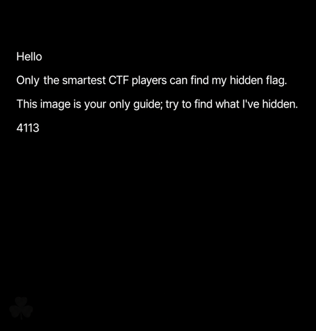
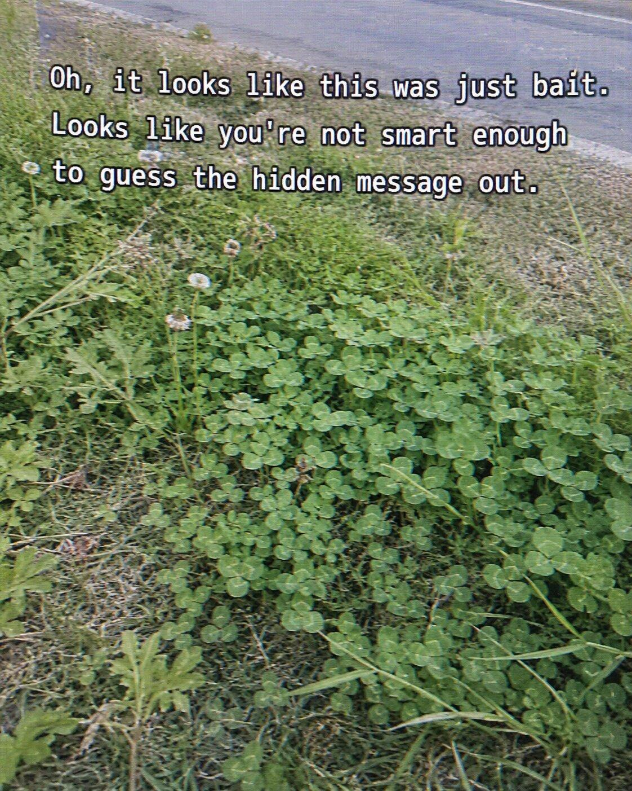

# SYC4113

## 题目简述

附件 `final.png` 表面上只有一段挑衅文字和编号 4113，但真正解法是一条多载体隐写链：PNG 尾随数据 → ASCII Caesar → 第二张 JPG → OutGuess → 植物志 PDF 书页坐标 → 压缩包中的摩斯码与语音 → 邮箱交互。

本题不能只记录最终邮箱。每一层的输出都是下一层输入，尤其是初始图片尺寸 $631\times661$ 会在最后重新参与计算，因此必须保留原始载体和中间提示图。

## 解题过程

### 1. 提取 PNG 的 IEND 尾随数据

初始载体尺寸为 $631\times661$：



PNG 在 `IEND` 块后仍有数据。按块结构跳过 `IEND` 类型和 CRC 后读取尾部，得到：

```text
JLHZHYZH`ZAo{{wzA66ptn5jku85}pw6p6=h9h=h9j?@i7?f8>?88=;<??5qwn
```

题目提示枚举 ASCII Caesar。对每个字节在模 128 下减 7，明文出现 `CEASARSAYS:` 和第二阶段 JPG 地址。下载得到的图片如下：



图中文字 “guess the hidden message out” 把单词 `out` 与 `guess` 刻意拆开，明确指向 OutGuess。

### 2. 使用 OutGuess 取得植物志坐标

以空密码提取第二张图：

```bash
outguess -r stage2-outguess-hint.jpg outguess.txt
```

输出包含植物志 `Fabaceae.pdf`、Base64 字符串、页码 550 和 27 组坐标。Base64 解码结果为：

```text
VHJpZm9saXVtIHJlcGVucw==  ->  Trifolium repens
```

坐标为：

```text
2:4:2:1   2:7:8:4   2:9:7:2   2:10:6:1
3:1:2:7   3:2:1:6
4:1:1:9   4:2:6:1   4:4:8:3
5:1:4:9   6:1:1:5
7:1:1:4   7:7:2:1   7:9:1:6
9:1:3:6   9:1:4:2   9:3:5:1   9:3:10:2   9:5:2:8   9:11:2:4
11:1:6:6  11:2:5:6  11:3:1:4  11:4:4:2  11:5:4:6
12:1:1:9  12:1:4:3
```

在 PDF 第 550 页中，把所有首行缩进约两格的自然段按“左栏从上到下，再到右栏从上到下”编号。第 7 段跨栏，右栏顶部是同一段续文，不能误算成新段。每组四元组按 `段号:段内行号:词号:字符号`、全部从 1 开始取字符，拼出：

```text
https://wwbrd.lanzoum.com/sycsecret
```

链接对应 `secret.zip`，其中包含 `morse.mp3` 和 `hint.wav`。正文已经写明 PDF 的植物名、页码、分段规则与坐标；即使不打开植物站介绍页，也能理解这层索引的全部机制。

### 3. 解码两段音频

`morse.mp3` 的短信号约 0.13 秒、长信号约 0.36 秒，按字母和单词间隔切分后得到：

```text
CONTACT US USING SYC FOLLOWED BY THE PRODUCT OF THREE PRIME NUMBERS
AND A 163 EMAIL ADDRESS.
```

也就是邮箱格式为 `SYC + 三个质数乘积 + @163.com`。

`hint.wav` 的人声指出其中一个质数是 523。其余两个质数回到第一层寻找：初始 PNG 的宽高正是 631 和 661，且二者均为质数。因此

$$
523\times631\times661=218138593.
$$

最终邮箱为：

```text
SYC218138593@163.com
```

向该邮箱发送邮件，回信给出：

```text
SCTF{A_voice_from_a_high_place_naturally_carries_far-it_is_not_relying_on_the_autumn_wind}
```

## 方法总结

本题最重要的习惯是为每层保存“输入、提取方法、原始输出和解释”，而不是看到 URL 就直接跳转。PNG 的尾随数据、JPG 的 OutGuess 信息和 PDF 的坐标都属于有意隐藏载荷，因此归入 stego；邮件只是最终交互。首图尺寸在结尾回用也是典型闭环提示，记录元数据时不能只抄可见文字。外链中真正决定解法的植物名、页码、坐标规则和压缩包内容都已写入正文，链接仅保留为可选的原始工件入口。
