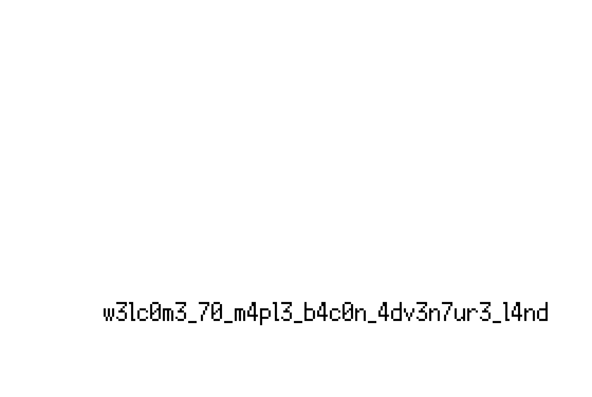

# CTF Adventure Land 1

## 题目简述

题目给出一款 Python/Pygame 平台游戏，并提示怪物在墙上留下了消息。游戏画面中看不到明文，但地图文件 map.png 的每个像素不是普通画面，而是一个关卡 tile。极接近白色的像素被映射为不可见墙，把这些像素单独提取后会拼出 flag。

## 解题过程

从 Map.py 可知，程序逐像素读取 map.png，再用 Tile.py 的 colorTotileId 映射解释。关键颜色为：

~~~text
(255, 255, 255) -> EMPTY
(254, 254, 254) -> INVIS_WALL
(145, 50, 0)   -> BACON_WALL
(0, 0, 0)      -> WALL
~~~

肉眼几乎无法区分 255 和 254，但可以把所有 (254,254,254) 像素涂黑、其他像素涂白并放大：

~~~python
from PIL import Image

source = Image.open("map.png").convert("RGB")
mask = Image.new("1", source.size, 1)
for y in range(source.height):
    for x in range(source.width):
        if source.getpixel((x, y)) == (254, 254, 254):
            mask.putpixel((x, y), 0)
mask.resize((source.width * 8, source.height * 8)).save(
    "hidden-wall-message.png"
)
~~~

提取出的不可见墙轮廓清楚组成文字：

图中正文为 w3lc0m3_70_m4pl3_b4c0n_4dv3n7ur3_l4nd，按题面格式包裹后得到：

~~~text
maple{w3lc0m3_70_m4pl3_b4c0n_4dv3n7ur3_l4nd}
~~~

## 方法总结

游戏题不应只盯着可执行逻辑；关卡图、贴图索引和颜色编码也可能直接承载信息。本题利用了两个几乎相同的白色值隐藏空间结构。面对像素地图，应先查加载代码，确定每种颜色的语义，再按 tile 类型制作高对比度掩码。
