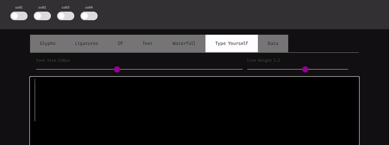

# flag Mono

## 题目简述

本题与 Broken Converter 共用同一个 XPS 文件。先从 XPS 中提取并还原 `flag Mono` 字体后，还能在字体的 OpenType `GSUB` 表中发现四个风格集：`ss01`、`ss02`、`ss03`、`ss04`。

这些风格集并非普通的字形美化。输入固定字符串 `flag`，每次单独启用一个风格集，GSUB 的上下文替换和多字形替换会依次显示四段隐藏文本，拼接后得到完整 flag。

## 解题过程

字体还原方法与 Broken Converter 相同：使用 `.odttf` 文件名中的 GUID 对前 32 字节异或，得到正常的 TrueType 文件。

读取字体表可以确认隐藏逻辑位于 `GSUB`：

```python
from fontTools.ttLib import TTFont

font = TTFont("flag-mono.ttf")
gsub = font["GSUB"].table

for record in gsub.FeatureList.FeatureRecord:
    print(
        record.FeatureTag,
        record.Feature.LookupListIndex,
    )
```

四个功能标签及入口如下：

| 风格集 | 入口 lookup | 内部替换 |
| --- | ---: | --- |
| `ss01` | 0 | 单字形 4、多字形 5 |
| `ss02` | 1 | 单字形 6、多字形 7 |
| `ss03` | 2 | 单字形 8、多字形 9 |
| `ss04` | 3 | 单字形 10、多字形 11 |

入口 lookup 的类型都是 chained contextual substitution。以 `ss01` 为例，字体中的规则包含：

```text
ampersand quotesingle | a @SingleSubstitution4 | g
| f @SingleSubstitution4 | l a g
ampersand quotesingle parenleft | g @MultipleSubstitution5 |
ampersand | l @SingleSubstitution4 | a g
```

竖线两侧描述上下文，`@SingleSubstitution4` 和 `@MultipleSubstitution5` 决定实际替换。多字形替换允许一个输入字形展开成一串输出，因此仅输入四个字符也能显示一整段文本。

在支持 OpenType 风格集的字体查看器中输入 `flag`，每次只打开一个开关，依次得到：

```text
ss01 -> SEKAI{OpenType
ss02 -> MagicGSUB
ss03 -> IsTuring
ss04 -> Complete}
```

动画完整展示了原始乱码与四段输出之间的切换：



按顺序拼接四段：

```text
SEKAI{OpenTypeMagicGSUBIsTuringComplete}
```

## 方法总结

字体不仅包含轮廓和字符映射，还可能包含会根据上下文改写字形序列的排版程序。检查可疑字体时，应枚举 `GSUB`/`GPOS`、连字、上下文替换和 `ss01` 至 `ss20` 等可选特性。本题把隐藏信息拆进四个风格集，只有使用同一触发词并分别启用功能后才能重组，属于利用排版机制实现的隐写。
