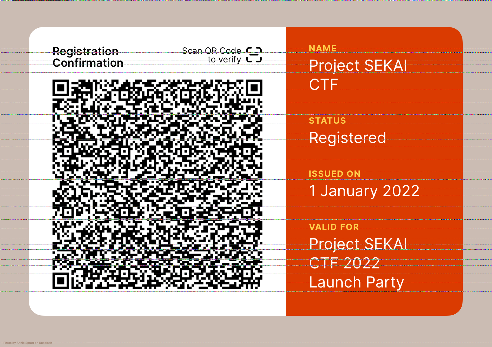
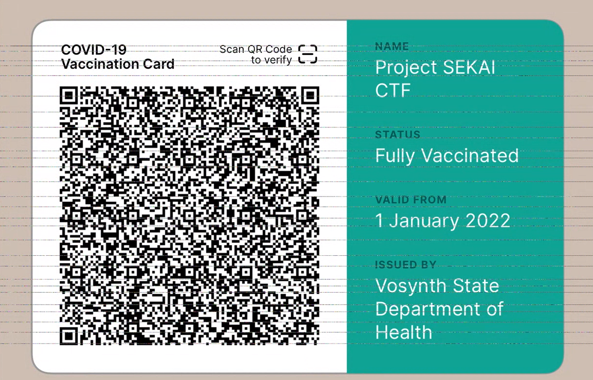

# Matryoshka

## 题目简述

Matryoshka 由四层嵌套载荷组成：

1. 从截图中的 ANSI 彩色笑脸恢复字节；
2. 利用 PNG 的 Apple `iDOT` 解析差异显示隐藏图片；
3. 解码图片中的 SMART Health Card 二维码，从 FHIR 数据取出音频地址；
4. 对双声道反相音频做混合，听取 NATO 字母表口令。

每层输出都是下一层的载体，必须保留中间数据和文件格式证据，不能只记录最终 flag。

## 解题过程

第一层截图中已经给出编码程序。程序把每个输入字节拆成两个 4 位半字节，再分别映射到 ANSI 的普通与高亮 8 色：

```python
stdin = sys.stdin.buffer.read()
bits = "".join(
    bin(value)[2:].zfill(8)
    for value in stdin
)

for offset in range(0, len(bits), 8):
    low = bits[offset:offset + 4]
    high = bits[offset + 4:offset + 8]

    high_code = (
        40 if high[0] == "0" else 100
    ) + int(high[1:], 2)
    low_code = (
        40 if low[0] == "0" else 100
    ) + int(low[1:], 2)
```

因此 16 种调色板颜色就是十六进制数字 `0` 至 `f`。按截图中每个笑脸的背景色查表，两个颜色还原一个字节，并交换截图中的半字节显示顺序。仓库的 `recog.py` 在固定网格坐标取样后输出：

```text
https://matryoshka.sekai.team/-qLf-Aoaur8ZVqK4aFngYg.png
```

该 URL 对应的 PNG 已随题目仓库保存。枚举 PNG 块可以看到：

```text
IHDR
iDOT
IDAT
IDAT
IEND
```

`iDOT` 是旧版 Apple 解码器使用的私有分块索引。文件故意构造了两套解析结果：普通解码器显示一张红色的“Registration Confirmation”卡片，并带有水平噪声线：



在支持该 `iDOT` 行为的旧版 iOS/macOS 解码器中，同一文件显示另一张青色的 COVID-19 疫苗卡：



扫描隐藏卡片中的二维码会得到以 `shc:/` 开头的 SMART Health Card。其数字串按每两位读成一个十进制数，再加上 45 转回字符，得到紧凑 JWS；解开 Base64URL/DEFLATE 载荷后，在 FHIR `Patient.contact.telecom.value` 中找到：

```text
data:text/html;base64,PGF1ZGlvIHNyYz0iaHR0cHM6Ly9tYXRyeW9zaGthLnNla2FpLnRlYW0vOGQ3ODk0MTRhN2M1OGI1ZjU4N2Y4YTA1MGI4ZDc4OGUud2F2IiBjb250cm9scz4=
```

Base64 解码结果为：

```html
<audio
  src="https://matryoshka.sekai.team/8d789414a7c58b5f587f8a050b8d788e.wav"
  controls>
```

仓库同样保存了该 WAV。文件是 16 kHz、16 位、双声道 PCM，长度约 26.172 秒。两声道相关系数约为 $-0.989$，说明强噪声主要处于反相状态。将左右声道相加或平均：

```python
speech = [
    (left + right) // 2
    for left, right in zip(
        left_channel,
        right_channel,
    )
]
```

反相成分相互抵消，留下较清晰的语音。语音依次读出：

```text
upper begin
sierra echo kilo alfa india
upper finish
open curly bracket
upper kilo alfa november delta oscar
upper romeo yankee oscar kilo oscar
five
upper foxtrot india victor echo
two
upper tango whiskey oscar
fower
upper foxtrot oscar uniform romeo
close curly bracket
```

把 NATO 单词、数字和大小写提示组合起来，得到：

```text
SEKAI{KandoRyoko5Five2Two4Four}
```

## 方法总结

多阶段隐写应逐层回答三个问题：当前载体的编码规则是什么、恢复出的数据属于什么格式、下一层目标在哪里。本题依次利用终端调色板、PNG 解码器差异、标准化健康凭证和双声道相位。外部解码器并非必要条件；理解 `iDOT`、SHC/JWS 与立体声相消后，每一层都可以离线复现。
