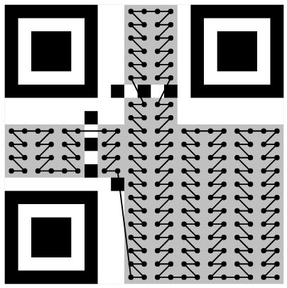

# QR God

## 题目简述

题目给出一张无法扫描的 21×21 QR 图，说明定位等固定图案完整、格式信息缺失，且所有数据位都还在。题面中的 “Gutenberg Diagram” 指从上到下、从左到右的普通阅读顺序：出题者把 QR 数据位按这种顺序填回网格，而 QR 标准实际使用从右下角开始、两列一组上下折返的扫描路径。


因此本题不是修复丢失像素，而是恢复数据模块的正确空间排列，再处理缺失格式信息所隐去的掩码编号。

## 解题过程

### 提取错误排列的数据位

Version 1 QR 的尺寸固定为 21×21。先标记所有功能模块，包括：

- 三个定位图案及其分隔区；
- 横纵时序图案；
- 左下角附近的暗模块；
- 两组格式信息位置。

题面保证固定图案完整，但格式位缺失。遍历网格时跳过上述模块，把剩余黑白模块按“从上到下、从左到右”读成位串。这一步得到 208 个被掩码的数据/纠错位，也就是 Version 1 QR 的 26 个码字。

### 按 QR 标准路径重新写入

QR 数据区从右下角开始，以相邻两列为一组：

1. 在当前列对内先读右列、再读左列。
2. 第一组自下向上，下一组自上向下，方向交替。
3. 每完成一组向左移动两列。
4. 遇到第 6 列的纵向时序图案时跳过该列。
5. 所有功能模块都不消耗数据位。



伪代码如下：

```python
def qr_data_positions(size, is_function):
    right = size - 1
    upward = True

    while right > 0:
        if right == 6:
            right -= 1

        rows = range(size - 1, -1, -1) if upward else range(size)
        for row in rows:
            for col in (right, right - 1):
                if not is_function[row][col]:
                    yield row, col

        upward = not upward
        right -= 2
```

把上一步提取的位串按该生成器依次写回，得到空间顺序正确、但仍处于掩码状态的数据区：


### 枚举缺失的掩码

QR 的格式信息通常给出纠错等级和掩码编号，但题目将其删除。数据没有损坏，所以无需做 Reed-Solomon 纠错；只需枚举 0 至 7 号掩码。对每个数据模块 $(i,j)$，按候选掩码条件决定是否翻转，功能模块不参与 XOR。

0 号掩码的条件是：

$$
(i+j)\bmod 2=0
$$

即在满足条件的模块上执行：

```text
原始数据位 = 当前模块位 XOR 1
```

使用 0 号掩码后，按相同的标准路径读取数据位，开头结构合法：

```text
0100 00010000 ...
```

- `0100` 表示 Byte 模式；
- `00010000` 表示数据长度为 16 字节；
- 随后的 128 位就是正文。

把 128 位按每 8 位转成 ASCII：

```python
mode = bits[:4]
length = int(bits[4:12], 2)
payload = bits[12:12 + length * 8]
message = bytes(
    int(payload[i:i + 8], 2)
    for i in range(0, len(payload), 8)
)
print(message.decode())
```

得到：

```text
SEKAI{G0d_Ch4mP}
```

## 方法总结

- 核心技巧：区分“像素阅读顺序”和 QR 的标准数据路径，先提取错误排列的完整位集，再按双列蛇形路径重写。
- 识别信号：21×21 尺寸对应 Version 1；定位图案完好、格式信息为空且题面强调 Gutenberg 顺序，说明问题在空间重排与掩码，而不是图像损坏。
- 复用要点：处理 QR 重组题时应分别维护功能模块掩码、数据坐标序列和掩码公式。格式位缺失时可枚举 8 种掩码，并用合法模式字段、长度字段和文本编码快速筛选正确候选。
