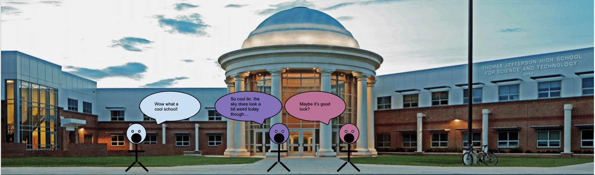
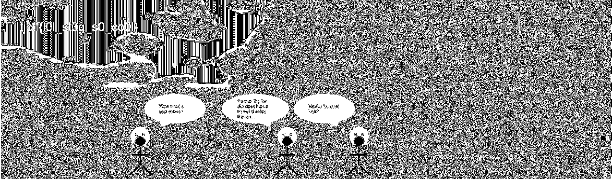

# cool-school

## 题目简述

附件是一张学校场景 PNG，正常显示时只有背景、人物与对话框。flag 被写入 RGB 通道最低有效位构成的位平面，肉眼查看原图看不到这层高频噪声中的浅色文字。



## 解题过程

检查 PNG 可知它是 8 位 RGBA 图。分别提取通道位平面后，红色通道 bit 0 的左上角能直接读到 flag。等价的 Pillow 操作为：

```python
from PIL import Image

img = Image.open('image.png').convert('RGBA')
red = img.getchannel('R')
lsb = red.point(lambda v: 255 if (v & 1) else 0, mode='L')
lsb.save('red-lsb-flag.png')
```

提取结果如下，左上角文字为 `tjctf{l0l_st3g_s0_co0l}`：



最终 flag：

```text
tjctf{l0l_st3g_s0_co0l}
```

## 方法总结

- PNG 无损保存像素低位，适合藏入 LSB；应按 R、G、B、A 与不同位序逐层观察。
- `zsteg` 的字符串扫描不一定能识别“以图形文字存在”的载荷，位平面仍需视觉核对。
- 归档时保留真正显现信息的派生图，比只贴正常原图更能说明证据链。
