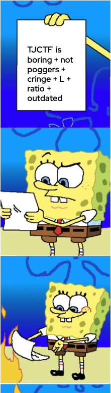

# spongebob

## 题目简述

PNG 正常显示只有三个海绵宝宝分镜，而题面提示原梗应有四格。文件的 IHDR 高度被改成 778，但 IDAT 解压后实际包含 1011 行像素；解码器按头部尺寸截断了最后一格。



## 解题过程

`pngcheck -vt image.png` 会报告 IEND 后还有数据。更关键的是合并 IEND 前的 IDAT 数据并解压：图像宽 221、RGBA 每像素 4 字节，每行还含 1 字节 PNG filter，因此行长为

$$
1+221\times4=885.
$$

解压长度为 894735 字节，恰好是 $885\times1011$，说明真实高度为 1011。修改 IHDR 的高度并重算该块 CRC：

```python
from pathlib import Path
import struct, zlib

b = bytearray(Path('image.png').read_bytes())
b[20:24] = struct.pack('>I', 1011)
b[29:33] = struct.pack('>I', zlib.crc32(bytes(b[12:29])) & 0xffffffff)

# 只保留到第一个 IEND；其后的额外 IDAT/IEND 是尾随数据。
end = b.find(b'IEND') + 8
Path('restored-fourth-panel.png').write_bytes(b[:end])
```

修复后的完整四格图如下：


第四格直接显示：

```text
tjctf{such_pogg3rs_ctf}
```

## 方法总结

- PNG 的 IHDR 尺寸与 IDAT 可解出的扫描线数量应交叉验证；能正常打开不代表所有像素都被展示。
- 修改 PNG 关键块后必须重算 CRC，否则严格解码器会拒绝文件。
- IEND 后的尾随块是独立异常，但本题恢复像素所需数据已经在第一个 IEND 前，不能把所有尾随数据盲目拼回主流。
