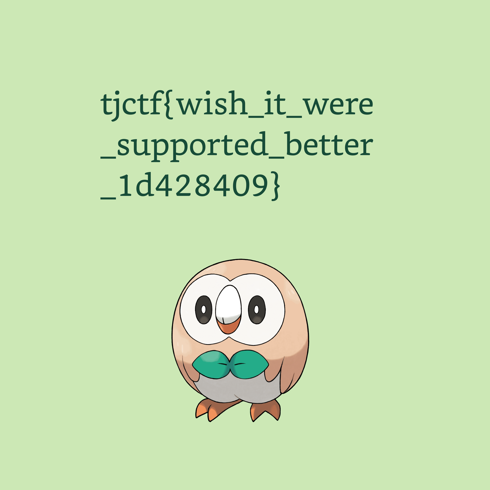

# minisculest

## 题目简述

题目给出一个仅约 20 KiB 的 `minisculest.png`，常规图像解码器无法正常显示。它并不是被大幅压缩的普通 PNG：生成代码把原 HEIC 文件的 `ftyp`、`meta`、`mdat` 三个 box 拆开，分别塞进 PNG 的两个 `tEXt` chunk 和一个 `IDAT` chunk。需要按两种容器各自的结构把 HEIC 重新拼回去。

## 解题过程

先按 PNG 格式读取 chunk：8 字节签名之后，每个 chunk 都是“4 字节长度、4 字节类型、数据、4 字节 CRC”。附件的顺序是 `IHDR`、`tEXt`、`tEXt`、`IDAT`、`IEND`。

两个 `tEXt` 数据以 `名称\x00Base64内容` 保存，对应 HEIC 的 `ftyp` 和 `meta`；`IDAT` 则是 zlib 压缩后的 `b"mdat" + box_data`。恢复代码如下：

```python
import base64
import struct
import zlib

def read_png_chunks(data: bytes):
    assert data[:8] == b"\x89PNG\r\n\x1a\n"
    pos = 8
    chunks = []
    while pos < len(data):
        length = int.from_bytes(data[pos:pos + 4], "big")
        kind = data[pos + 4:pos + 8]
        body = data[pos + 8:pos + 8 + length]
        chunks.append((kind, body))
        pos += 12 + length
    return chunks

def heif_box(kind: bytes, body: bytes, last=False):
    size = 0 if last else len(body) + 8
    return struct.pack(">I", size) + kind + body

chunks = read_png_chunks(open("minisculest.png", "rb").read())
_, ftyp_chunk, meta_chunk, mdat_chunk, _ = chunks

ftyp_name, ftyp_text = ftyp_chunk[1].split(b"\x00", 1)
meta_name, meta_text = meta_chunk[1].split(b"\x00", 1)
mdat_raw = zlib.decompress(mdat_chunk[1])

heic = (
    heif_box(ftyp_name, base64.b64decode(ftyp_text))
    + heif_box(meta_name, base64.b64decode(meta_text))
    + heif_box(mdat_raw[:4], mdat_raw[4:], last=True)
)
open("recovered.heic", "wb").write(heic)
```

用支持 HEIC 的查看器打开恢复文件，可以看到木木枭和写在画面上的 flag：



```text
tjctf{wish_it_were_supported_better_1d428409}
```

## 方法总结

- 文件扩展名只说明外壳，不能替代结构检查；本题必须同时理解 PNG chunk 与 ISO BMFF/HEIC box。
- `tEXt` 中的载荷先 Base64 解码，`IDAT` 中的载荷先 zlib 解压，三段处理方式不同。
- 原始伪 PNG 没有可展示的有效视觉内容，因此 WP 只保留语义命名的恢复结果图，并在正文完整转写其中的 flag。
