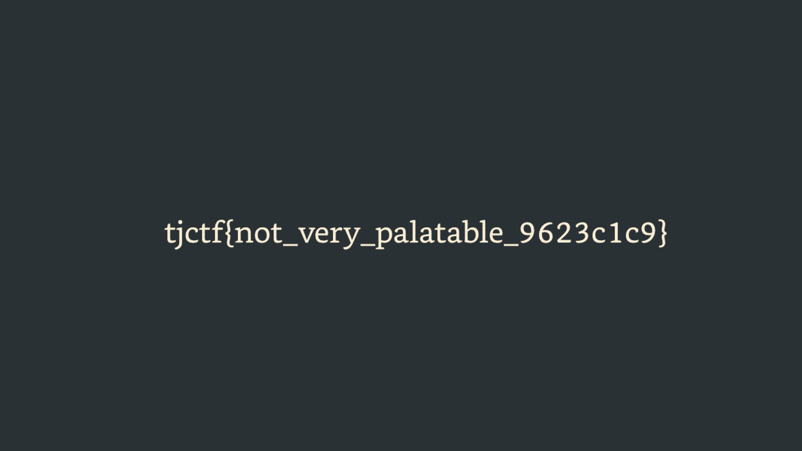

# pals

## 题目简述

题目给出一张看似纯深灰色的索引 PNG。像素索引数据并未被抹掉，问题出在 `PLTE` 调色板：40 个条目全部被替换成同一个 RGB 值 `#283135`，所以不同索引在显示时变成同一种颜色。恢复任意能区分 40 个索引的调色板，即可重新看到原图。

## 解题过程

索引 PNG 的 `IDAT` 保存的是调色板下标，而实际颜色由 `PLTE` 定义。题目生成器保留 `IHDR`、`IDAT`、`IEND`，只把 `PLTE` 改成 40 份相同颜色，因此没有必要修改像素。

可以用 Pillow 直接替换调色板。为避免随机颜色影响可读性，使用递增灰度最稳定：

```python
from PIL import Image

image = Image.open("pals.png")
count = 40
colors = [(i, i, i) for i in range(0, 256, 256 // count)][:count]
palette = [channel for color in colors for channel in color]
palette.extend([0] * (768 - len(palette)))

image.putpalette(palette)
image.save("restored.png")
```

恢复后，原先相同颜色的区域按索引分层，中央文字清晰可见：



```text
tjctf{not_very_palatable_9623c1c9}
```

## 方法总结

- 对纯色索引 PNG，应区分“所有像素索引相同”和“不同索引被映射成相同颜色”；检查 `color type=3` 与 `PLTE` 可迅速判断。
- 恢复不要求猜回原调色板，只要给每个索引分配不同颜色，隐藏在索引空间中的形状就会出现。
- WP 保留的是可读的恢复结果，而不是没有信息增量的纯色原图；图片文件名与替代文字均说明了恢复动作和视觉内容。
