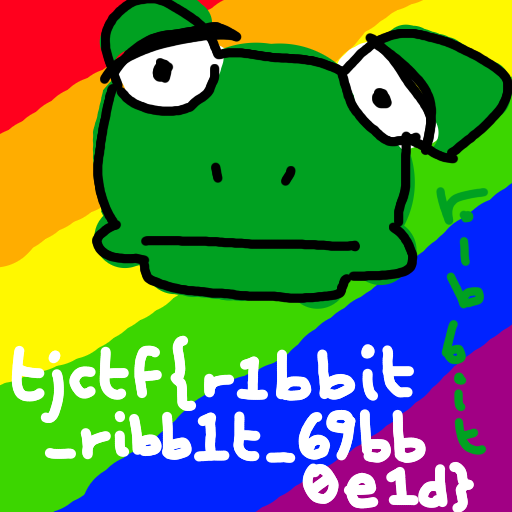

# purified

## 题目简述

题目提供一份 QOI 图像 `out.qoi`。生成器没有把 flag 直接编码成 QOI 像素，而是反复把“上一层完整文件的字节串”当成下一张图片的原始像素，再依次保存为 BMP、TIFF、WebP、TGA、SGI 和 PNG，最后转换成 QOI。每解开一层图像并取 `tobytes()`，得到的正好是下一层文件。

## 解题过程

外层 QOI 可以由 Pillow 打开。调用 `Image.tobytes()` 后，不应把结果当成普通像素继续显示，而应尝试把这段字节重新作为图片文件解析。重复该过程，直到字节不再能被识别为新图像；最后一次成功打开的图像就是原始内容。

```python
from io import BytesIO
from PIL import Image, UnidentifiedImageError

image = Image.open("out.qoi")

while True:
    inner = image.tobytes()
    try:
        image = Image.open(BytesIO(inner))
        image.load()
    except UnidentifiedImageError:
        break

image.save("final.png")
```

恢复结果是一张彩色青蛙图，左下角白字写出 flag：



```text
tjctf{r1bbit_ribb1t_69bb0e1d}
```

## 方法总结

- 这里的嵌套不是“文件尾追加另一个文件”，而是把内层文件字节作为外层像素缓冲区；普通 `binwalk` 只搜签名不一定能跨层完成。
- 每轮应保存“最后一次成功解析的 Image”，因为最终 `tobytes()` 已经是原始像素，不再是另一份图片文件。
- 恢复图具有直接视觉证据价值，因此以语义化名称保留；正文同时转写 flag，读者无需依赖看图识字。
