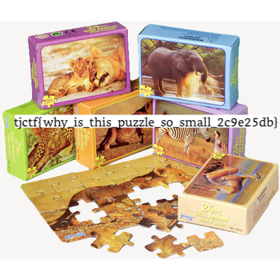

# puzzling

## 题目简述

题目给出一张像素被打散的 `shuffled.png`。生成器把原图像素每 15 个分成一块，用 Python `random.Random` 洗牌；随机种子不是秘密，而是生成器源代码的字节长度。更直接的是，这份源代码被压缩后保存在 PNG 的 `zTXt` 字段 `generator code` 中，因此附件本身包含完整逆变换依据。

## 解题过程

Pillow 会自动解压 `zTXt`，可从 `image.info['generator code']` 取得源代码。以其长度初始化同一 PRNG，对块编号执行相同 `shuffle`，就能建立“洗牌后位置到原位置”的逆映射。

原图有 $350\times350=122500$ 个像素，不是 15 的整数倍，最后一块只有 10 个像素。短块被移动到中间后，再从保存图像按固定 15 像素切片会造成边界错位。官方解法因此枚举 0 到 14 的 `shift`，在短块位置前后重新拼接相邻片段，然后应用逆置换；15 幅候选中只有一幅文字清晰。

```python
import random
from PIL import Image

image = Image.open("shuffled.png")
code = image.info["generator code"]
pixels = list(image.getdata())
blocks = [pixels[i:i + 15] for i in range(0, len(pixels), 15)]

rng = random.Random(len(code))
order = list(range(len(blocks)))
rng.shuffle(order)
short_position = {original: shuffled for shuffled, original in enumerate(order)}[len(blocks) - 1]

for shift in range(15):
    aligned = []
    for i, block in enumerate(blocks):
        if i > short_position:
            aligned.append(blocks[i - 1][shift:] + block[:shift])
        elif i == short_position:
            aligned.append(block[:shift])
        else:
            aligned.append(block)

    restored = [None] * len(aligned)
    for shuffled, original in enumerate(order):
        restored[original] = aligned[shuffled]
    flat = [pixel for block in restored for pixel in block][:len(pixels)]

    output = Image.new(image.mode, image.size)
    output.putdata(flat)
    output.save(f"candidate-{shift}.png")
```

正确候选恢复出拼图盒照片及横向 flag：



```text
tjctf{why_is_this_puzzle_so_small_2c9e25db}
```

## 方法总结

- PNG 文本 chunk 可能直接携带生成器或参数；应先检查元数据，再尝试盲目图像重排。
- 已知 PRNG 种子后，逆洗牌本身很简单；真正的坑是最后一个非满长块导致重新切片后的相位偏移。
- 原始乱序图没有可复用视觉信息，WP 只保留语义命名的恢复图，并在正文转写其中的文字。
