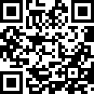
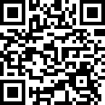

# masked

## 题目简述

附件是一张 29×29 模块、每模块放大为 4×4 像素的 QR Code。生成器保留定位图形、时序图形和对齐图形等功能区，却把其余数据模块同时异或了 QR 标准中的八种掩码条件。QR 掩码本质是按坐标决定是否翻转模块，重复应用同一组合即可还原。

## 解题过程

原图的功能区仍能辨认，但数据区被多重掩码破坏：



先从每个 4×4 单元左上角取样得到 29×29 二值矩阵。对于不在 `reserved` 矩形内的模块，重新计算生成器中的八个条件并异或；XOR 自反，因此第二次应用会撤销第一次翻转。

```python
from PIL import Image

size = 29
scale = 4
source = Image.open("qrcode.png").convert("RGB")
modules = [
    0 if source.getpixel((x * scale, y * scale)) == (255, 255, 255) else 1
    for y in range(size)
    for x in range(size)
]

reserved = [
    ((0, 0), (8, 8)), ((9, 6), (20, 6)), ((6, 8), (6, 20)),
    ((0, 21), (8, 28)), ((21, 0), (28, 8)), ((20, 20), (24, 24)),
]

def is_reserved(x, y):
    return any(x1 <= x <= x2 and y1 <= y <= y2
               for (x1, y1), (x2, y2) in reserved)

def combined_mask(x, y):
    conditions = [
        (x + y) % 2 == 0,
        y % 2 == 0,
        x % 3 == 0,
        (x + y) % 3 == 0,
        (y // 2 + x // 3) % 2 == 0,
        (x * y) % 2 + (x * y) % 3 == 0,
        ((x * y) % 3 + x * y) % 2 == 0,
        ((x * y) % 3 + x + y) % 2 == 0,
    ]
    value = False
    for condition in conditions:
        value ^= condition
    return int(value)

for y in range(size):
    for x in range(size):
        index = y * size + x
        if not is_reserved(x, y):
            modules[index] ^= combined_mask(x, y)

output = Image.new("RGB", (size * scale, size * scale), "white")
pixels = output.load()
for y in range(size):
    for x in range(size):
        color = (0, 0, 0) if modules[y * size + x] else (255, 255, 255)
        for dy in range(scale):
            for dx in range(scale):
                pixels[x * scale + dx, y * scale + dy] = color
output.save("unmasked.png")
```



扫描还原图得到：

```text
tjctf{n0tc4tchingc0vid}
```

## 方法总结

- 核心技巧：按模块坐标重放多种 QR mask，并利用 XOR 自反性撤销翻转。
- 识别信号：定位/时序结构完好但数据区不可解码，且生成逻辑明确区分功能区与普通模块。
- 复用要点：先确认模块尺寸和坐标方向；功能模块不能参与反掩码，否则即使数据区正确也会破坏 QR 定位和纠错。
