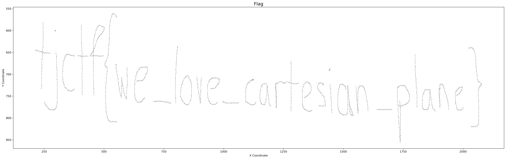

# mouse-trail

## 题目简述

题目给出数千行鼠标坐标，夹杂注释和可能损坏的行。坐标记录的是屏幕空间中的手写轨迹：$x$ 向右增加，$y$ 向下增加。按原坐标散点绘制并反转纵轴后，点云会显现手写 flag。

## 解题过程

逐行忽略空行、注释和无法解析的数据，只保留 `x,y` 整数对。这里不应按输入顺序连线，因为损坏或跳跃点可能产生贯穿整图的伪线；使用足够小的散点即可恢复笔迹密度。

```python
import matplotlib.pyplot as plt

points = []
with open("mouse_movements.txt", "r", encoding="utf-8") as f:
    for line in f:
        line = line.strip()
        if not line or line.startswith("#"):
            continue
        try:
            x, y = map(int, line.split(","))
        except ValueError:
            continue
        points.append((x, y))

x_values, y_values = zip(*points)
plt.figure(figsize=(25, 8))
plt.scatter(x_values, y_values, s=0.1, color="black", alpha=0.8)
plt.gca().invert_yaxis()
plt.axis("equal")
plt.axis("off")
plt.tight_layout()
plt.savefig("mouse-writing.png", dpi=300, bbox_inches="tight")
```



笔迹内容为：

```text
tjctf{we_love_cartesian_plane}
```

## 方法总结

- 核心技巧：把坐标日志还原为空间点云，并按屏幕坐标系反转 $y$ 轴。
- 识别信号：大量二维坐标、题面询问“what I was drawing”、坐标范围呈现宽而低的书写画布。
- 复用要点：先用散点观察整体形状，再决定是否连线；坐标系方向、等比例缩放和异常点处理都会直接影响可读性。
