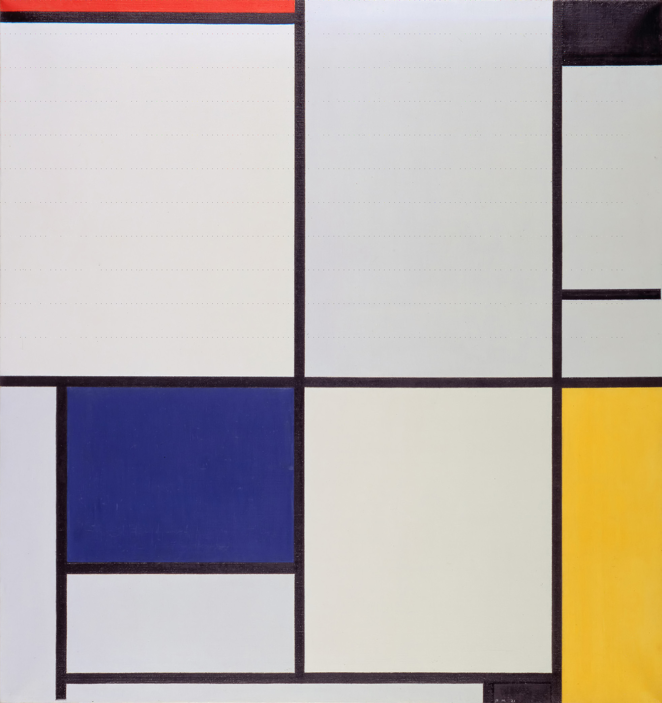

# thats-pietty-cool

## 题目简述

附件表面是一幅 Mondrian 风格图片，但生成器把一张 Piet 程序图的像素稀疏写入其中：Piet 图坐标 $(x,y)$ 被放到载体坐标 $(15x,100y)$。这些彩色点在大图中很不显眼；按固定步长采样、裁剪为 124×11 后即可恢复可执行的 Piet 程序。

## 解题过程

下图中横向每隔 15 像素、纵向每隔 100 像素出现的细小彩点就是隐藏程序，而不是压缩噪声：



按生成器的坐标关系反采样。载体尺寸为 1964×2085，先得到 130×20 的采样图，再裁出左上角实际使用的 124×11 区域：

```python
from PIL import Image

carrier = Image.open("runme.png").convert("RGB")
sampled = Image.new("RGB", (carrier.width // 15, carrier.height // 100))

for x in range(sampled.width):
    for y in range(sampled.height):
        sampled.putpixel((x, y), carrier.getpixel((x * 15, y * 100)))

program = sampled.crop((0, 0, 124, 11))
program.save("recovered.ppm")
```

Piet 以颜色块之间的色相/亮度变化编码栈操作和控制流。恢复后不需要人工翻译整个程序，直接用 `npiet` 解释执行：

```bash
npiet recovered.ppm
```

输出为：

```text
tjctf{p1et_pr1nt3r}
```

## 方法总结

- 核心技巧：从大图的规则稀疏坐标重建小型 Piet 程序，再交给解释器执行。
- 识别信号：自然图像中出现周期固定的异常彩点，题目同时提示“find it”与“run the image”。
- 复用要点：先通过异常点间距推断采样步长，确认坐标方向和裁剪边界；保存为无损 RGB/PPM，避免调色板或 JPEG 压缩破坏 Piet 色块。
