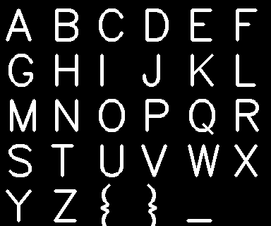
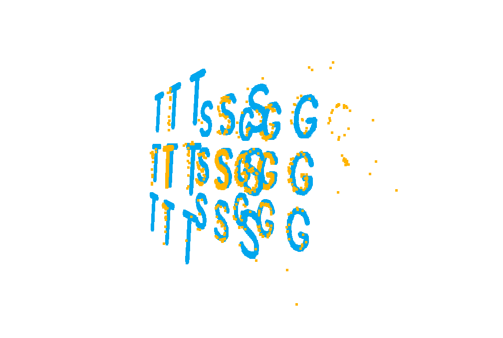
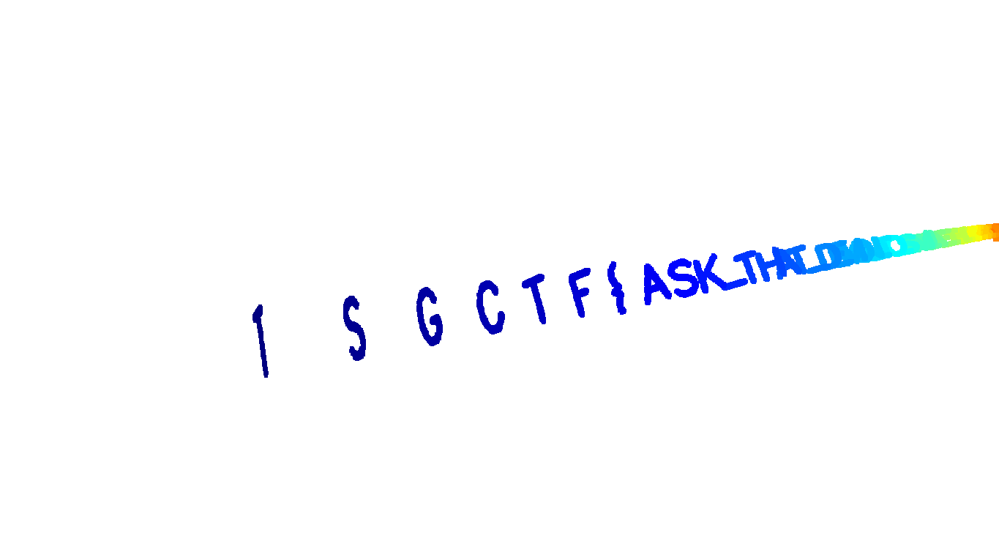

# TSGCTF2024 Scattered in the fog WP

## 题目简述

题目给出一个 NumPy 点云文件 `problem.npy`，要求从三维散点中恢复符合 `TSGCTF{...}` 格式的字符串。源码把大写字母、花括号和下划线用 OpenCV 字体绘制在 $64\times64$ 的单元格中，再把每个字符的前景像素转换为三维点：字符内部坐标放在 $x,y$ 平面，字符序号写入 $z=64(i-i_0)$。随后，生成器给 $x,y$ 坐标叠加若干个 $64$ 的整数倍，使同一个字形被打散到相邻单元格；最后对整个点云施加随机三维旋转、随机平移并打乱点的顺序。

因此，附件不是普通图片，而是一幅经过“周期平移、刚体变换、乱序”三层处理的三维文字。决定性任务是找回字符轴和字形平面的朝向，再利用 $64$ 像素的周期折叠消除散射。

题目同时提供了完整字符模板。下图按源码中的顺序展示了 `A-Z`、`{}` 和 `_` 的字形，它也是后续点云配准的基准。



## 解题过程

先载入坐标并减去均值，去掉未知平移：

```python
coords = np.load("problem.npy")
coords -= coords.mean(axis=0)
```

整个 flag 沿字符序号方向延伸得很长，而字形只在另外两个方向占据有限宽度，因此对中心化后的坐标做 PCA，可以稳定找出纵向的字符轴。官方解法按实际可视化结果调整主成分的顺序和符号：

```python
pca = PCA(3).fit(coords)
rot = np.array([
    pca.components_[2],
    pca.components_[1],
    -pca.components_[0],
])
vecs = coords @ np.linalg.inv(rot)
```

PCA 只能确定三个正交主轴，无法可靠区分方差相近的字形横轴与纵轴，也存在轴的正负号歧义。这里利用已知 flag 前缀 `TSG` 消除剩余自由度：沿恢复出的字符轴截取最前面的三个字符，按照生成器相同的 OpenCV 字体构造 `TSG` 三维模板，并在 $x,y$ 方向各复制到相邻的 $3\times3$ 个周期单元中。

把截取出的原始点云作为 source、`TSG` 模板作为 target，先以 64 为最大对应距离粗配准，再以 2 为阈值精配准。下图中橙色点为题目点云，蓝色点为模板；二者重合后即可确定字形平面的完整旋转关系。



```python
reg = o3d.pipelines.registration.registration_icp(
    source, target, 64, np.eye(4),
    o3d.pipelines.registration.TransformationEstimationPointToPoint(),
)
reg = o3d.pipelines.registration.registration_icp(
    source, target, 2.0, reg.transformation,
    o3d.pipelines.registration.TransformationEstimationPointToPoint(),
)
```

官方 solver 随后把截取范围扩大到已知前缀 `TSGCTF` 并再次配准，以减少只用三个字符造成的误差。将最终刚体变换应用到全部点后，真正的散射只剩 $x,y$ 上的 $64$ 整数倍偏移。对两个坐标分别取模即可把所有副本折回一个字符单元：

```python
vecs += translation
vecs = vecs @ rotation.T
vecs -= initial_translation

vecs[:, [0, 1]] = np.fmod(vecs[:, [0, 1]], 64)
vecs[:, [0, 1]] = np.fmod(vecs[:, [0, 1]] + 64, 64)
```

第二次取模用于把负余数规范到 $[0,64)$。此时按字符轴观察点云，字形已经重新聚合，开头可以直接读出 `TSGCTF{ASK...`：



顺着字符轴依次读取全部 63 个字符，得到：

```text
TSGCTF{ASK_THAT_DEMON_TO_SIMULATE_THE_REVERSE_OF_SPILL_PROCESS}
```

## 方法总结

这题的关键不是从噪声中猜字符，而是逐层逆转生成流程。中心化消除平移，PCA 恢复方差显著的字符轴；由于字形平面内两个方向的方差接近，再用已知前缀构造模板并通过 ICP 找回完整姿态；最后依据生成器中噪声始终是 64 的整数倍这一性质，对 $x,y$ 坐标取模，精确撤销周期散射。

已知格式在这里不是只用于确认答案，而是提供了点云配准所需的方向锚点。面对类似三维文字或周期点云题，应先从源码识别保持不变的量：刚体变换保持点间几何关系，整数周期平移在模周期意义下不改变单元内坐标。把这两类不变量分别利用，问题就能从混乱的三维散点还原为普通的字形识别。
