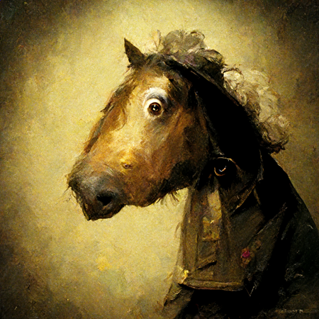

# Collection

## 题目简述

附件 `collection.zip` 中有 47 张 `450×450` 的 PNG，文件名分别对应 UIUCTF 2022 的各道题。题目提示说明：每张图只改动了一个像素，改动位置均为 $(0,y)$，其中 $y$ 是该字符在 flag 中的下标；该像素的蓝色通道就是字符的 ASCII 值。

这道题在原比赛中放在 Misc，并特意写了“not stego”，但决定性障碍仍然是从图片像素中提取隐蔽信息，因此归档到 `stego`。

资源目录中保留了附件解出的全部 47 张原始 PNG。下面是排序后的第一张：



## 解题过程

### 确认图片顺序与坐标含义

压缩包没有额外的索引文件。对文件名按字典序排序后恰好得到 47 张图片，而题目元数据中的 flag 也有 47 个字符。提示中的“`y` represents the index of a character”因此可以直接解释为：排序后第 $i$ 张图的有效像素位于 $(0,i)$。

前几项可人工核对：

```text
i=0  ahorsewithnonames.png   B=117  -> u
i=1  ahorsewithnoneighs.png  B=105  -> i
i=2  arpwny.png              B=117  -> u
i=3  asr.png                 B= 99  -> c
i=4  blackboxwarrior.png     B=116  -> t
i=5  brokeyn.png             B=102  -> f
i=6  commandnotfound.png     B=123  -> {
```

得到的开头正是 `uiuctf{`，说明排序、坐标方向和通道都正确。

### 逐图提取蓝色通道

把压缩包解到与 WP 同名的 `UIUCTF2022-collection-wp` 目录后，可用 Pillow 读取像素：

```python
from pathlib import Path
from PIL import Image

root = Path("UIUCTF2022-collection-wp")
paths = sorted(root.glob("*.png"))

chars = []
for i, path in enumerate(paths):
    with Image.open(path) as src:
        image = src.convert("RGB")
        red, green, blue = image.getpixel((0, i))
    chars.append(chr(blue))
    print(f"{i:02d} {path.name:30s} B={blue:3d} {chr(blue)!r}")

flag = "".join(chars)
print(flag)
```

完整输出拼接为：

```text
uiuctf{Th1s_c0llect10n_is_n0w_c0mpl3ted_4f2335}
```

如果不使用提示，原始预期流程是把每张修改图与 CTFd 上对应题目的原图逐像素比较：差分中唯一变化点的纵坐标给出字符下标，修改后蓝色通道给出字符值。公开仓库没有同时保存那 47 张未修改原图，所以本文采用题目明确公开的坐标提示，并直接对附件完成逐字验证。

## 方法总结

- 先确认“文件顺序、像素坐标、颜色通道、字符编码”四个映射关系，再批量读取；只看到可打印字符还不足以证明顺序正确，`uiuctf{` 前缀提供了低成本校验。
- 这里的蓝色值是字符本身，而不是与原像素的差值；原图用于定位被改动的坐标，题目提示已经直接泄露了该坐标规律。
- 分类应看获取 flag 的决定性机制。即使原标签写着 Misc，逐图定位并提取隐藏像素仍属于图像隐写。
