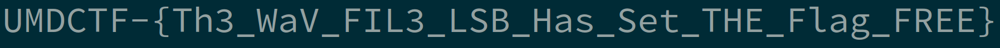

# Free The Flag

## 题目简述

`free_the_flag.wav` 是约 188 秒的 44.1 kHz、16 bit 单声道 PCM。普通播放和常规频谱没有给出完整 flag。题目中的 “trapped inside” 暗示把样本的最低有效位串联成独立文件。

## 解题过程

按时间顺序读取每个 little-endian `int16` 样本，只取 bit 0，再以每 8 bit、最高位在前的方式打包：

```python
import wave
from pathlib import Path

import numpy as np

with wave.open("free_the_flag.wav", "rb") as wav:
    assert wav.getnchannels() == 1
    assert wav.getsampwidth() == 2
    samples = np.frombuffer(
        wav.readframes(wav.getnframes()),
        dtype="<i2",
    )

bits = (samples & 1).astype(np.uint8)
payload = np.packbits(bits, bitorder="big").tobytes()
assert payload.startswith(b"\x89PNG\r\n\x1a\n")
Path("lsb-flag.png").write_bytes(payload)
```

最低位数据从偏移 0 开始就是一张宽幅 PNG：



图片内容为：

```text
UMDCTF-{Th3_WaV_FIL3_LSB_Has_Set_THE_Flag_FREE}
```

其 SHA-256 与 README 中的 `2ba69c5a5b33ec32457235dc703826fa2eb9e599ed210484c9d9b4e2c4068276` 一致。

## 方法总结

音频 LSB 题需要明确三种顺序：样本端序、样本遍历顺序和 bit 打包顺序。本题使用 little-endian PCM 读取样本，但提取出的比特流按 MSB-first 组成字节。用 PNG magic 作为结构校验，比只看输出是否“像文件”更可靠。
