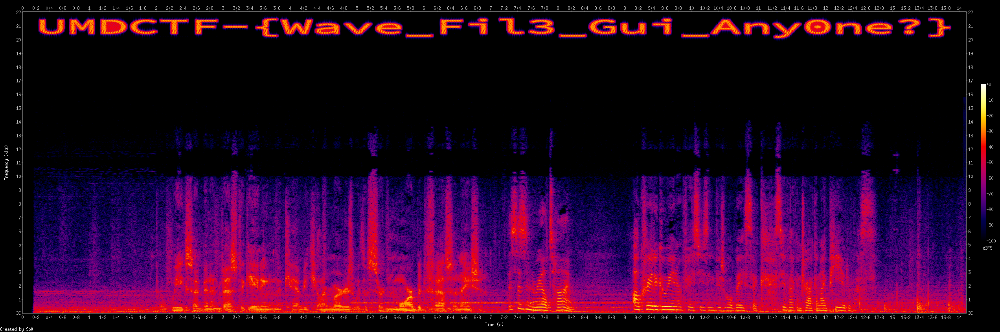

# Synesthesia 1

## 题目简述

附件 `synesthesia.wav` 是一段约 14 秒的音频。正常播放只能听到声音，但题名 “Synesthesia” 暗示把听觉信息转换成视觉表示，因此应检查频谱图。

## 解题过程

用 SoX 生成覆盖全时长和可听频段的频谱图：

```bash
sox synesthesia.wav -n spectrogram -o flag-spectrogram.png
```

在约 20 kHz 到 22 kHz 的高频区域，可以直接看到按时间横向绘制的文字：



频谱字体中的 `i`、`l`、`1`、`0` 和 `o` 容易混淆。结合图形逐字符读取，并用 README 的 SHA-256 校验，精确结果为：

```text
UMDCTF-{Wave_Fil3_Gui_Any0ne?}
```

其摘要为 `233363e25ce85e8eb4f9c7983a017d5c1386db77806230244ce9ad81906a83f2`。

## 方法总结

音频隐写首先应同时检查波形与时频图。高频文字可能几乎不影响听感，却会在频谱中形成稳定图案。视觉读取后仍要用官方摘要消除相似字形的歧义，不能只凭肉眼猜大小写和数字。
