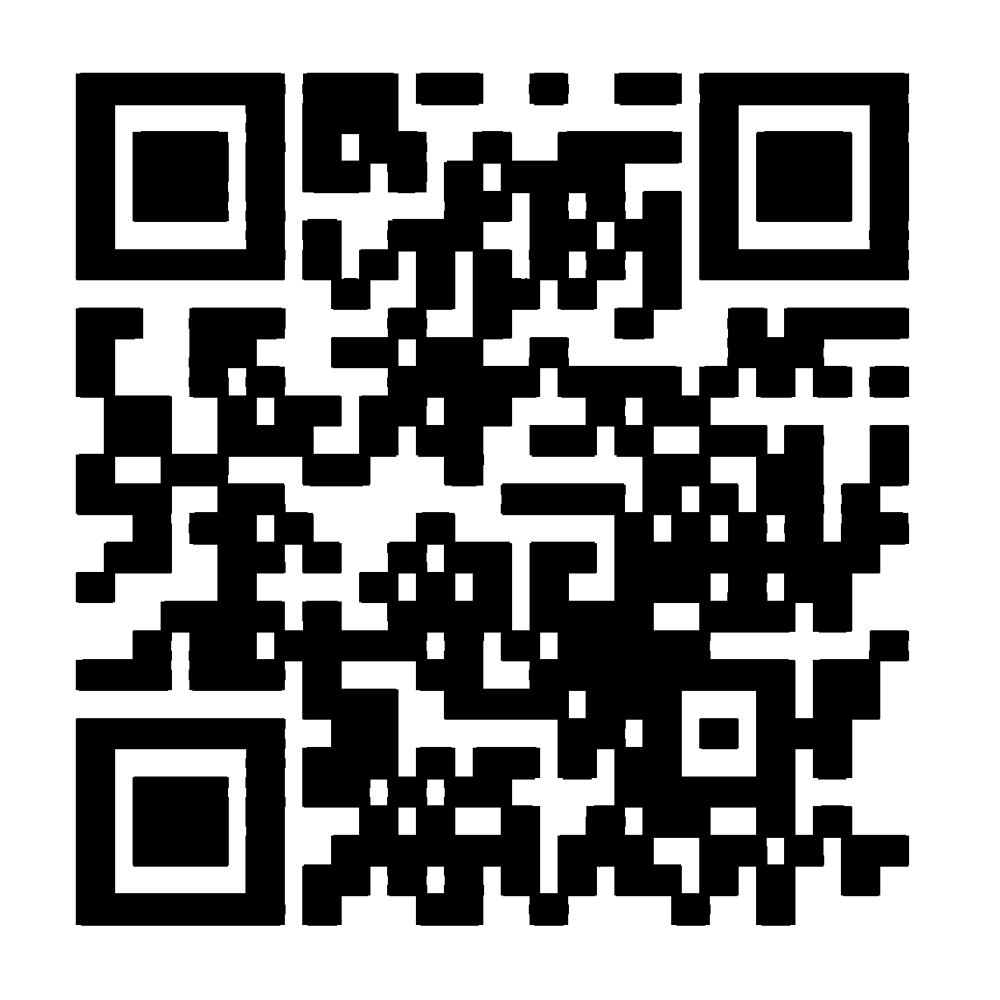

# Synesthesia 2

## 题目简述

第二个 WAV 是 44.1 kHz、单声道、32 bit little-endian PCM。直接绘制频谱只能看到诱饵文字：

```text
Nice try, but keep looking
```

这说明隐藏层不在正常的 32 bit 样本幅值中，而在样本的字节表示里。最终线索是小端样本最低地址处的那个字节。

## 解题过程

取每个 `int32` 样本的最低 8 bit，将其重新解释为有符号 8 bit 波形；为了写成通用 WAV，再扩展到 16 bit：

```python
import numpy as np
from scipy.io import wavfile

rate, samples = wavfile.read("synesthesia_2.wav")
assert samples.dtype == np.dtype("<i4")

low = (samples & 0xFF).astype(np.int16)
low[low >= 128] -= 256
wavfile.write("low-byte.wav", rate, (low << 8).astype(np.int16))
```

对 `low-byte.wav` 绘制频谱后，不再是文字，而是由横向频率线段组成的 29×29 QR 图案。谱线在垂直方向很细，可先阈值化，再做纵向膨胀和小范围闭运算，把每条线恢复成二维码模块：

```python
import numpy as np
from PIL import Image
from scipy.ndimage import binary_closing, binary_dilation

gray = np.asarray(Image.open("qr-lines.png").convert("L"))
foreground = gray >= 100
filled = binary_dilation(foreground, structure=np.ones((13, 1), dtype=bool))
filled = binary_closing(filled, structure=np.ones((3, 3), dtype=bool))

quiet = 80
canvas = np.zeros(
    (filled.shape[0] + 2 * quiet, filled.shape[1] + 2 * quiet),
    dtype=bool,
)
canvas[quiet:-quiet, quiet:-quiet] = filled
Image.fromarray(np.where(canvas, 0, 255).astype(np.uint8)).save("qr.png")
```

恢复出的二维码如下：



扫码得到：

```text
UMDCTF-{S0m3time_Th3_ByTe_ORDER_MatTerS}
```

其 SHA-256 与 README 中的 `ea03c2d525c20814825c923d3a090075fe571c5546d43e4219fd8f43e3cdde54` 一致。

## 方法总结

高位宽 PCM 的不同字节可以承载彼此独立的信号。正常播放器按完整 32 bit little-endian 整数解释样本，最低字节中的小信号会被高位声音掩盖；把该字节单独提升为音频后，隐藏频谱才会显现。二维码谱线还需要按其几何方向做有限形态学修复。
