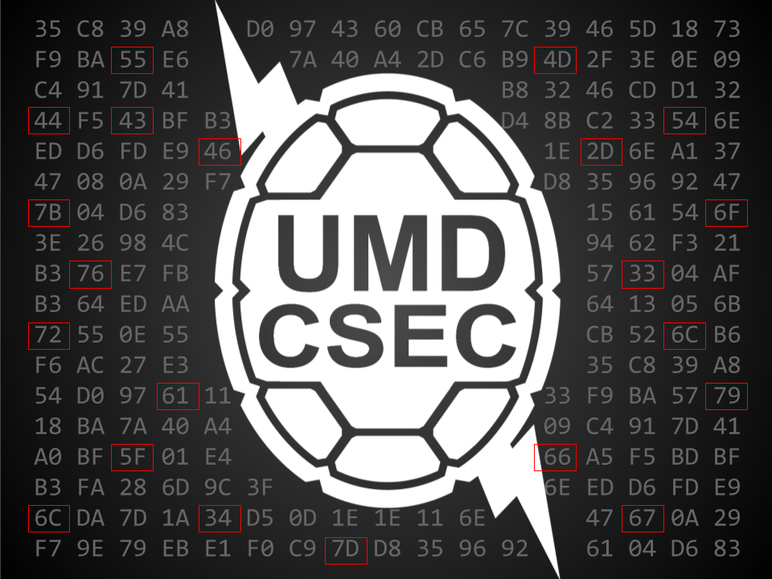

# UMDCTF 2018 - Desktop Background

## 题目简述

附件是一张能够正常显示的 PNG 桌面背景。题目提示其中加入了取证元素；真正的线索位于 PNG 规范结束位置之后，属于把第二张图像附加在载体文件尾部的隐写。

## 解题过程

先解析 PNG 数据块，找到 `IEND` 块的末尾。原文件在此之后仍有 4699 字节，文件头为另一个 PNG：

```python
data = open("Desktop Background.png", "rb").read()
iend = data.index(b"IEND")
png_end = iend + 8
open("hidden.png", "wb").write(data[png_end:])
```

提取出的透明图层包含一组红色方框。将它按原尺寸叠加回背景，方框会准确框住背景中的若干十六进制字节：



按从上到下、从左到右的顺序读取：

```text
55 4D 44 43 54 46 2D 7B 6F 76 33 72 6C 61 79 5F 66 6C 34 67 7D
```

将十六进制按 ASCII 解码：

```text
UMDCTF-{ov3rlay_fl4g}
```

该字符串的 SHA-1 与仓库 `README.md` 中保存的摘要一致。

## 方法总结

能正常打开的 PNG 仍可能在 `IEND` 后携带附加数据。发现第二个透明图层后，不应只单独查看，还要依据相同尺寸和坐标系叠加到原图；本题的红框只有在叠加后才构成完整的选字节规则。
