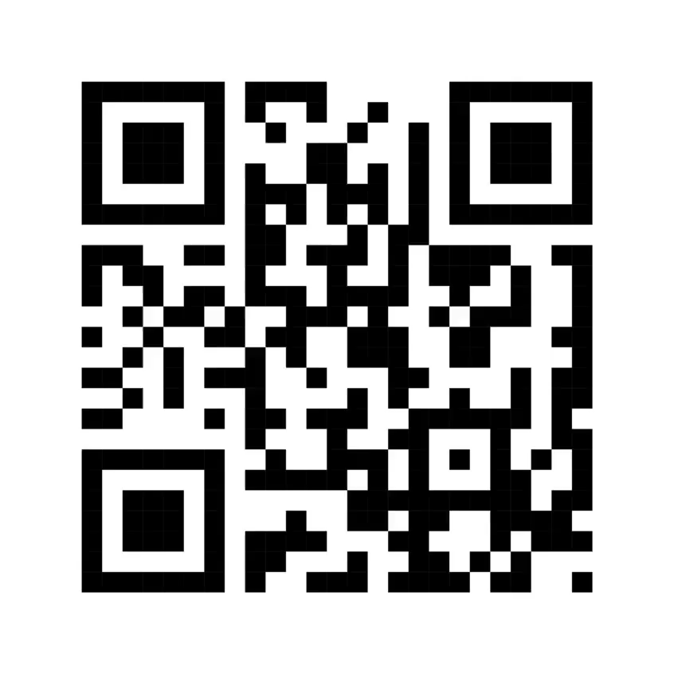

# UMDCTF 2018 - Shrek This Out

## 题目简述

附件 `ogre.mp4` 是一段快速切换二维码的视频。有效载荷被拆成多帧二维码，恢复时需要按帧序重组，而不是只扫描某一张画面。

## 解题过程

先将视频逐帧导出。共得到 172 帧，第一帧二维码的内容是 JSON 元数据，其中 `framecount` 为 `172`：



从第 2 帧开始，每个二维码保存一个独立的 Base64 片段。逐帧扫描时使用一次只取一个结果的模式，避免同一画面被识别出额外的伪结果；然后按帧号依次解码：

```python
import base64
import zlib

compressed = b"".join(
    base64.b64decode(chunk, validate=True)
    for chunk in decoded_frames[1:]
)
payload = zlib.decompress(compressed)
```

这里不能先把所有 Base64 文本拼成一条再只解码一次，因为每一帧都可能自带填充符 `=`。正确方式是逐片段 Base64 解码，再拼接二进制压缩流。

解压后得到一个 100259 字节的 JPEG，SHA-256 为：

```text
2ce2de750c338368d286017421220135f6ec4808c1259c8c01d1026ecf0129c1
```


用元数据工具检查该 JPEG，可以看到 `Artist` 字段：

```text
UMDCTF-{ogres_are_like_onions}
```

该字符串的 SHA-256 为：

```text
a004d23703aed0c0eea10effda81f038a9bb559eaf6444a000b9cd00cf2642bf
```

与 `README.md` 的官方摘要一致。

## 方法总结

视频二维码题要同时保证帧完整、顺序正确和分层解码正确。先用首帧元数据核对帧数，再逐帧 Base64 解码、拼接压缩数据、解压并检查最终文件元数据，可以让每一层都有明确的结构校验。
