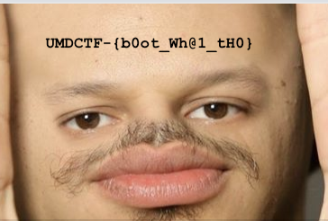

# UMDCTF 2018 - WhyTho

## 题目简述

附件 `whythis.html` 在页面脚本中藏入一段经过 JavaScript 十六进制转义和百分号编码的 HTML。解码后还能得到一个 Base64 数据 URI，最终 flag 以文字形式绘制在图片上。

## 解题过程

定位脚本数组 `_0x6c49` 的第二个元素，先还原 `\xNN` 转义，再执行 URL 百分号解码：

```python
import base64
import codecs
import re
import urllib.parse
from pathlib import Path

text = Path("whythis.html").read_text(encoding="utf-8")
match = re.search(
    r"var _0x6c49=\['[^']*','([^']*)'\]",
    text,
)
encoded = codecs.decode(match.group(1), "unicode_escape")
hidden_html = urllib.parse.unquote(encoded)

payload = re.search(
    r"data:image/png;base64,([^']+)",
    hidden_html,
).group(1)
image = base64.b64decode(payload, validate=True)
Path("revealed-flag-image.png").write_bytes(image)
```

恢复出的 PNG 为 364×246 像素，SHA-256 为：

```text
4ee0f99394b5b43449ab0c263225bb6a8cfc9e7f42e80c32f324e8a17a9ed9fc
```



图片中的文字是：

```text
UMDCTF-{b0ot_Wh@1_tH0}
```

README 的 SHA-256 对应 flag 加换行符后的字节序列：

```text
ba2828ea65d19914a52d5b6bdda5495e3dfc74e2bc6ded3c89a6c30c6041ef54
```

## 方法总结

浏览器脚本中的 `unescape`、百分号字符串和 `data:` URI 往往意味着多层嵌入。应按实际编码顺序逐层拆解，并在每层确认输出类型；最终图片承担了视觉信息，因此保留语义化命名的原图，而不是把它当作可删除的代码截图。
