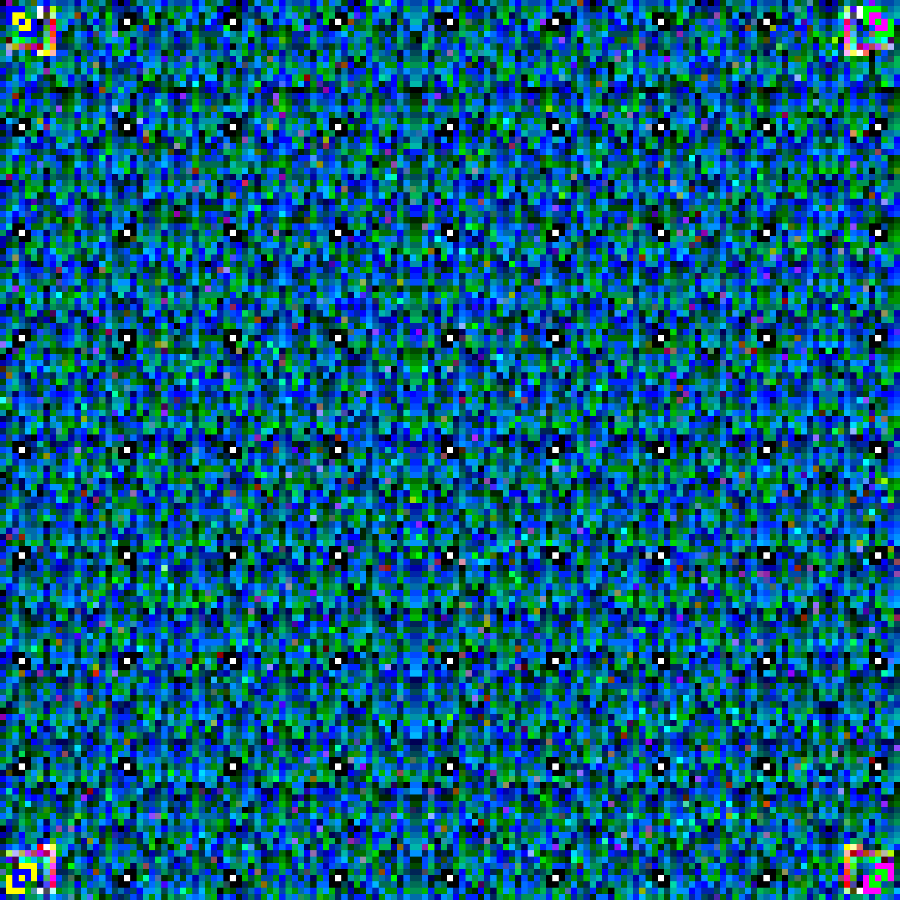

# UMDCTF 2019 - Jogging Around Bethesda

## 题目简述

附件是一张彩色方块码。它不是常见二维码，而是 JAB Code（Just Another Bar Code）：利用多种颜色提高单位面积容量的二维条码。

## 解题过程

原图的彩色模块和定位图案是识别与纠错所必需的视觉信息：



使用当前版本解码器会失败，不是图片损坏，而是题目生成于 JAB Code 格式演进之前。官方 [JAB Code 仓库的历史提交 `2ece74e`](https://github.com/jabcode/jabcode/tree/2ece74e798c48b0eb0988636308653411a74b83c) 保留了与题目兼容的旧解码逻辑。检出该固定提交并编译 decoder：

```bash
git clone https://github.com/jabcode/jabcode.git
cd jabcode
git checkout 2ece74e798c48b0eb0988636308653411a74b83c
make
```

用历史 decoder 读取 `challenge.png` 后得到：

```text
UMDCTF-{w00dland_th3_father_of_b@r_c0des}
```

其 SHA-256 与官方摘要一致。标题首字母 `JAB` 也正好给出了编码名称。

## 方法总结

条码解码失败时，需要区分图像质量问题和格式版本不兼容。这里保留固定历史提交链接，因为它是复现所需的稳定源码依据；同时已在正文中说明 JAB Code 的性质、版本差异和具体提交，即使不访问外链也能理解关键机制。
