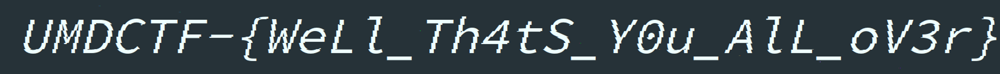

# UMDCTF 2019 - Scarecrow

## 题目简述

附件扩展名为 PNG，但正常查看和文件头检查都不协调。题面问“走哪一个方向”，提示需要改变读取方向。把整个文件字节顺序反转后才出现合法 PNG，且 PNG 尾部还附加了一张 BMP。

## 解题过程

先对全部字节做逆序，而不是只反转像素行：

```python
from pathlib import Path

raw = Path("scarecrow.png").read_bytes()[::-1]
Path("reversed.png").write_bytes(raw)
print(raw[:8])
```

输出开头是标准 PNG 签名 `89 50 4e 47 0d 0a 1a 0a`。继续检查 `IEND` 后的尾随数据，可以找到 `BM` 文件头：

```python
png_end = raw.index(b"\x00\x00\x00\x00IEND\xaeB`\x82") + 12
bmp_start = raw.index(b"BM", png_end)
Path("hidden.bmp").write_bytes(raw[bmp_start:])
```

恢复的 BMP 带有影响直接预览的透明/颜色信息；按其像素内容转成不透明 PNG 后，得到关键横幅：



```text
UMDCTF-{WeLl_Th4tS_Y0u_AlL_oV3r}
```

其 SHA-256 与官方摘要一致。

## 方法总结

扩展名不能替代文件签名。题目先用全文件逆序破坏 magic，再利用合法图片尾部可附加任意数据的特点嵌入第二张图。处理时要区分“恢复容器方向”和“carve 尾随文件”两个步骤，并通过实际渲染确认隐藏图像内容。
