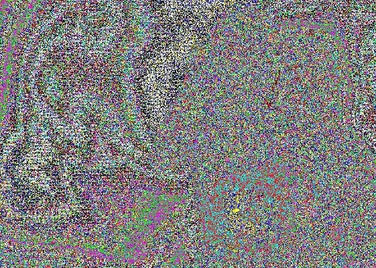

# Colors

## 题目简述

附件是一张带有强烈彩色噪声的肖像。噪声本身没有形成可读图案，真正的载荷通过 steghide 嵌入 JPEG；题目名同时给出了口令 `colors`。



## 解题过程

先用 `steghide info` 检查载体，可以确认其中包含嵌入文件。以题目名作为密码提取：

```sh
steghide extract -sf colors.jpg -p colors
```

提取出的文本内容为：

```text
UMDCTF-{Did you have some trouble? Colors are difficult :)}
```

flag 内的空格、问号和笑脸均属于原文，不能擅自规范化。
该文本来自载体内实际提取文件；README 中的哈希与附件结果不一致。

## 方法总结

面对 JPEG 隐写题，应先检查 steghide 等常见容器，而不是把所有明显噪声都当作像素位平面。题目名或描述常被用作弱口令；提取后还要原样保留特殊字符。
