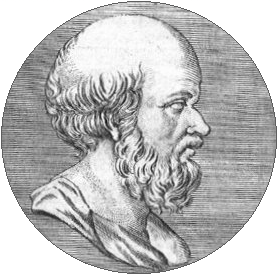

# Cool Coin

## 题目简述

附件是一枚带有埃拉托色尼头像的硬币图片。人物线索指向“埃拉托色尼筛”，说明隐藏数据不是按连续像素读取，而是位于素数编号的像素位置。



## 解题过程

先用筛法生成不超过像素总数的素数下标，再只读取这些位置的最低有效位。对通道顺序和位序做常见组合检查时，可以直接使用 zsteg 的 prime 像素提取能力，也可自行实现：

```python
def primes(limit):
    sieve = bytearray(b"\x01") * limit
    sieve[:2] = b"\x00\x00"
    for value in range(2, int(limit ** 0.5) + 1):
        if sieve[value]:
            sieve[value * value:limit:value] = b"\x00" * (
                (limit - value * value - 1) // value + 1
            )
    return [index for index, keep in enumerate(sieve) if keep]
```

按素数索引重组最低位字节后，能读到：

```text
UMDCTF-{in_st3g_we_trus7}
```

该文本由公开 PNG 的素数像素通道直接恢复；README 中的哈希与附件结果不一致。

## 方法总结

图像主题往往直接提示采样序列。本题决定性线索不是硬币，而是埃拉托色尼；从素数位置取位后再按字节重组，才是与题意一致的隐藏通道。
