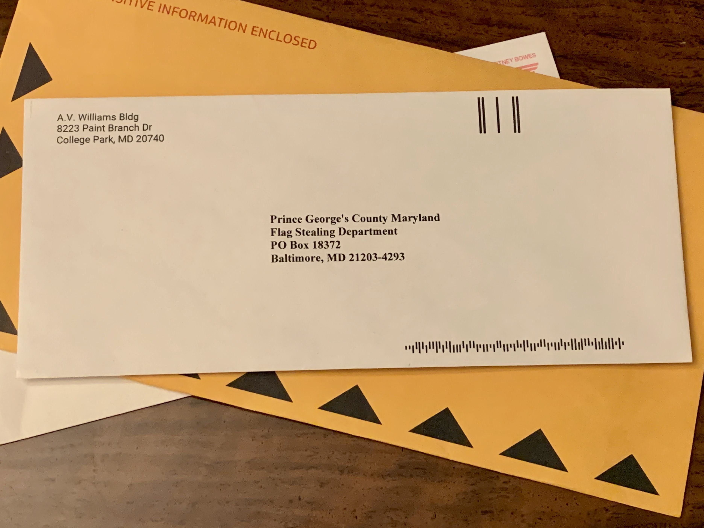

# Flag Thief

## 题目简述

附件是一张信封图片。右下角排列着两种长度的线段，它们不是装饰，而是用短线和长线表示二元符号的 Bacon 密码；解出字母后还需要进行一次 ROT13。



## 解题过程

按从左到右、从上到下的顺序记录线段，把短线记为 `A`、长线记为 `B`，每五个符号分成一组。使用 26 字母版本的 Bacon 码表查表，会得到一段仍然不像最终答案的拉丁字母。

题面与中间结果共同提示还存在凯撒式变换。对中间字符串执行 ROT13：

```python
import codecs

bacon_text = input("Bacon 解码结果：").strip()
print(codecs.decode(bacon_text, "rot_13"))
```

最终得到：

```text
UMDCTF-{Shhh}
```

## 方法总结

图像中重复出现的两种几何状态通常可以先抽象成二进制。Bacon 密码以五位为一组，分组边界必须保持；若第一层输出仍是规则字母串，再根据题目线索检查 ROT13 等简单替换。
