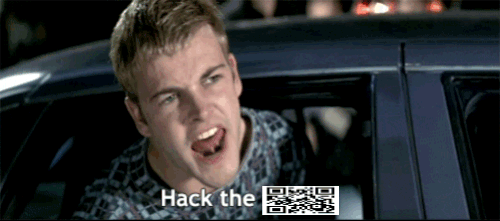

# Zero Cool

## 题目简述

附件是动画 GIF。大多数帧只提供正常动画，其中第 16 帧短暂出现一枚纵横比例被压缩的二维码；需要逐帧检查并校正比例。



## 解题过程

使用 Pillow 遍历帧并保存可疑帧：

```python
from PIL import Image

image = Image.open("zero-cool.gif")
image.seek(15)
frame = image.convert("RGB")
frame.save("hidden-qr-frame.png")
```

帧编号从 0 开始，所以 `15` 是播放顺序中的第 16 帧。裁剪二维码区域后按最近邻插值拉回正方形，并适当增加四周白色静区，即可扫描得到：

```text
UMDCTF-{tr4sh1ng_th3_fl0w}
```

## 方法总结

GIF 隐写应逐帧检查，不能只查看第一帧或合成预览。二维码被缩放时，要保持模块边缘锐利并补足静区；最近邻插值比双线性缩放更适合这种离散图案。
