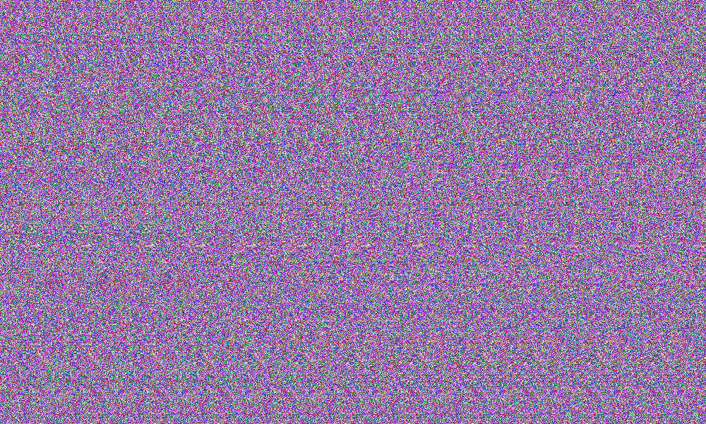

# Magic

## 题目简述

题目给出一张看似随机重复纹理的图片。它是单幅随机点自立体图（autostereogram）：左右错位的重复纹理编码了深度层，隐藏文字不能通过普通色彩增强直接看到。



## 解题过程

可以用两种方法观察：

1. 交叉眼或平行眼让双眼分别对准相邻纹理周期，使隐藏深度浮现；
2. 在 StegSolve 的 stereogram solver 中调整横向偏移，比较图像与其平移副本。

对本图使用约 `72` 像素的横向偏移时，隐藏字符轮廓最清晰。按轮廓读取后得到：

```text
UMDCTF-{th15_15_b14ck_m4g1k}
```

偏移量不是密码学常量，而是背景纹理的重复周期；不同查看器缩放后，界面上显示的数值可能略有变化，因此应以原始像素尺寸操作。

## 方法总结

自立体图依靠空间视差，而不是最低位或元数据。先检查纹理是否具有稳定横向周期，再用差分/平移叠加寻找深度图。保留原始分辨率非常重要，缩放和重采样会破坏周期并降低隐藏轮廓的可见性。
