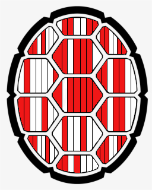

# Testudo's Message

## 题目简述

题目图片中有三列龟壳图案，每列包含七条红白相间的条带。颜色是二进制位，三列分别编码字符；需要确定位值、列顺序和缺失的最高位。



## 解题过程

把红色记作 `1`、白色记作 `0`，按每列从上到下读取七位。ASCII 字符通常使用 7 位，因此在最高位前补 `0`，得到完整的 8 位字节：

```text
0bbbbbbb
```

按图片中正确的列顺序逐列转成整数，再用 `chr()` 还原。连续处理全部龟壳后得到 flag 内容：

```text
h!dd3n_$h3lls
```

套入格式：

```text
UMDCTF-{h!dd3n_$h3lls}
```

如果首次结果不可读，应优先尝试反转单列的上下位序或列的读取顺序，而不是任意交换红白含义；可打印 ASCII 是很强的校验条件。

## 方法总结

视觉二进制题应明确四个维度：分组边界、读取方向、颜色映射和端序。本题每个龟壳天然给出 7 位分组，补零后正好落入 ASCII。用完整 flag 前缀验证排列，可避免仅凭局部字母猜答案。
