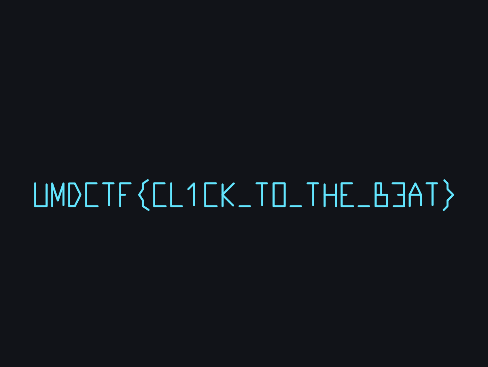

# UMDCTF2022 RSI 2 Writeup

## 题目简述

附件 `big_b.osr` 同样是 osu! 回放，但这次 LZMA 数据区包含 1300 余个真实格式的回放帧。玩家的鼠标轨迹被刻意画成 flag；直接播放不易看清，解析坐标并绘图更稳定。

回放头中的 beatmap MD5 为 `2d687e5ee79f3862ad0c60651471cdcc`，但恢复 flag 不需要下载谱面或申请 osu! API key。

## 解题过程

按 OSR 结构定位 LZMA 数据。本地解析得到压缩长度 2422 字节，解压后是 24793 字符、约 1308 个逗号分隔记录。每帧格式为：

```text
delta|x|y|keys
```

其中 `delta` 是相对时间，`x,y` 是 osu! Standard 的游标坐标，`keys` 是按键位图。丢弃起止哨兵和超出 $0\le x\le512,\ 0\le y\le384$ 的坐标，在 `keys == 0` 或 `(0,0)` 处断开笔画：

```python
segments = []
segment = []

for frame in replay_data.split(","):
    if not frame:
        continue
    delta, xs, ys, keys = frame.split("|")
    x, y, keys = float(xs), float(ys), int(keys)

    if keys and 0 <= x <= 512 and 0 <= y <= 384:
        segment.append((x, y))
    else:
        if len(segment) > 1:
            segments.append(segment)
        segment = []
```

osu! 屏幕坐标的 $y$ 轴向下，而普通数学绘图的 $y$ 轴向上，所以绘制时要反转纵轴。得到清晰的游标书写轨迹：



读取结果：

```text
UMDCTF{CL1CK_TO_THE_B3AT}
```

## 方法总结

与 RSI 1 相比，本题不能把解压结果直接当作文本，而要解释回放帧语义。绘图时应过滤哨兵、按键释放帧并在笔画间断线，否则跨字符连线会降低可读性。坐标系方向也是关键：若不反转 $y$ 轴，文字会垂直镜像。
