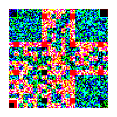

# Squarsa

## 题目简述

题目只给出一张彩色噪声状小图。红、绿、蓝三个通道各自藏着一张不同的 QR 码，但二维码的定位块与校准结构被涂黑；修复后可得到 RSA 参数。

由于主要工作是从颜色平面中定位并修复隐藏载荷，归入 Stego；后半段再利用模数为完全平方数的异常 RSA。



## 解题过程

先分别导出 R、G、B 通道并阈值化。每个平面都能看到 QR 模块布局，但左上、右上、左下的 7×7 finder pattern 以及必要的 timing/alignment 模块被破坏。按 QR 规范补回黑白同心定位框、分隔白边和交替时序线后，三个二维码分别解出 $n$、$p$ 与密文 $c$。

参数满足：

$$
n=p^2,\qquad q=p.
$$

普通 RSA 教程常写 $\varphi(n)=(p-1)(q-1)$，但该式默认 $p\ne q$。本题 $n=p^2$，正确欧拉函数为：

$$
\varphi(p^2)=p(p-1).
$$

于是：

```python
e = 65537
phi = p * (p - 1)
d = pow(e, -1, phi)
m = pow(c, d, n)
flag = m.to_bytes((m.bit_length() + 7) // 8, "big")
print(flag.decode())
```

解密结果：

```text
UMDCTF{Squar5_1n_R54&C0105_p14n3s}
```

## 方法总结

- 彩色噪声中出现规则方块时，应分别检查 RGB/Alpha 通道；多个二值载荷叠加后会掩盖各自的结构。
- QR 的 finder、separator、timing 和 alignment pattern 具有固定几何规范，可按版本和尺寸人工补回。
- 对 $n=p^2$，必须使用 $\varphi(n)=p(p-1)$；误用 $(p-1)^2$ 会得到错误私钥指数。
- 题名 “Squarsa” 同时提示 square 与 RSA，是从修复二维码转向异常模数的关键。
