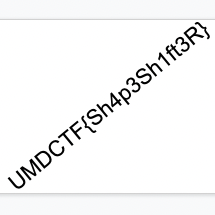

# UMDCTF2022 Xorua Writeup

## 题目简述

题目给出同为 34062 字节的 `Before.png` 和 `After.png`。`Before.png` 可以正常显示，`After.png` 虽以 PNG 命名却无法作为正常图片解析。两者并非用于比较可见像素差，而是把恢复图逐字节异或后形成的一对数据。

决定性步骤是从两个等长载体中重组隐藏图像，因此归入 `stego`。

## 解题过程

异或满足自反性质：

$$
A \oplus (A \oplus F)=F
$$

若 `After.png = Before.png XOR flag.png`，将两个文件的原始字节逐一异或即可恢复 `flag.png`。这里必须处理文件字节，不能先用图像库解码像素，因为 `After.png` 本身不是有效的可显示 PNG：

```python
from pathlib import Path

before = Path("Before.png").read_bytes()
after = Path("After.png").read_bytes()

assert len(before) == len(after)
recovered = bytes(a ^ b for a, b in zip(before, after))
Path("xor-recovered-flag.png").write_bytes(recovered)
```

输出以标准 PNG 魔数 `89 50 4e 47 0d 0a 1a 0a` 开头。打开后可见斜排的 flag 文本：



转写为：

```text
UMDCTF{Sh4p3Sh1ft3R}
```

## 方法总结

扩展名相同不代表两个文件都应先解码。遇到一个正常文件和一个同长度、魔数损坏的文件时，应先比较原始字节并测试 XOR 等可逆关系。本题恢复结果本身带有完整 PNG 文件头，既验证了运算方向，也排除了偶然得到可打印字符串的可能。
