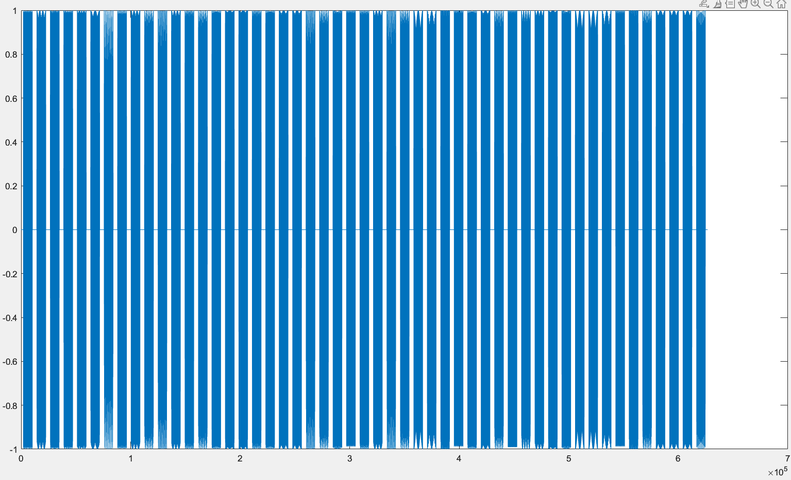

# beep-boop

## 题目简述

附件 `sound.wav` 由生成脚本把 flag 的每个字符编码成一段双音。采样率为
$F_s=8192$ Hz，每个字符持续约 1 秒，相邻字符之间有约 0.5 秒静音：



若字符 ASCII 值为 $c$，两个余弦频率分别是

$$
f_1=13c,\qquad f_2=11(c-50).
$$

所以只需分割音频、对每段做频谱分析，再把峰值频率代回线性关系。

## 解题过程

### 按静音分割字符

生成器在每个音调前后各放入约 0.25 秒零样本，因此波形中会出现清晰的长静音区。官方脚本使用固定索引：

```text
初始静音约 2031 个样本
音调约 8202 个样本
字符间隔约 4094 个样本
```

更稳健的做法是按短时能量阈值检测连续非静音区，避免音频转码或端点差一个样本后整体错位。

### 用 FFT 获取双峰

对单个音调 $x[n]$ 计算 FFT，只保留 $0$ 至 $F_s/2$ 的正频率部分：

```python
spectrum = abs(np.fft.rfft(segment))
freqs = np.fft.rfftfreq(len(segment), d=1 / sample_rate)
peak_ids = np.argpartition(spectrum, -4)[-4:]
peaks = freqs[peak_ids]
```

对每个显著峰分别尝试逆映射：

$$
c_1\approx\operatorname{round}(f/13),\qquad
c_2\approx\operatorname{round}(f/11+50).
$$

因为同一个字符应同时产生 $13c$ 和 $11(c-50)$，可在可打印 ASCII 范围内枚举
$c$，选择两个预测频率都与观测峰值接近的候选：

```python
def decode_peaks(peaks):
    candidates = []
    for code in range(32, 127):
        error = (
            min(abs(peaks - 13 * code))
            + min(abs(peaks - 11 * (code - 50)))
        )
        candidates.append((error, chr(code)))
    return min(candidates)[1]
```

按时间顺序连接 51 个字符，得到：

```text
UMDCTF{do_you_actually_enjoy_signal_processing_???}
```

## 方法总结

- 核心技巧：按静音切分双音段，用 FFT 找到两个谱峰，再反解字符对应的线性频率映射。
- 识别信号：生成器公开、每个字符对应固定时长稳定音调且存在明显静音边界时，应从频域而不是逐样本波形寻找不变量。
- 复用要点：FFT 最大值返回的是频点索引，不一定等于 Hz；应使用采样率和段长换算真实频率，并用两个峰共同验证字符。
