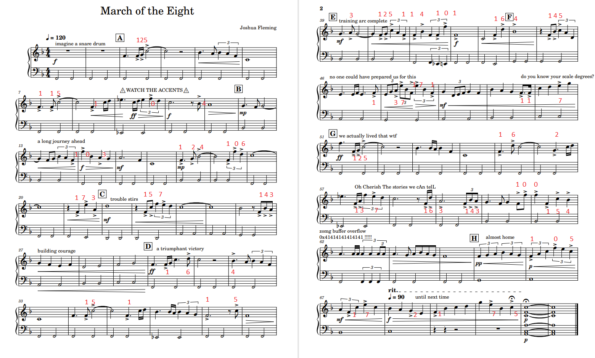

# March of the Eight

## 题目简述

题目给出两页乐谱。谱面有一个降号，低音从 F 开始，因此调性是 F 大调。正文中的三条提示分别给出完整解码路线：

- `WATCH THE ACCENTS`：只读取带重音记号 `>` 的音符；
- `do you know your scale degrees?`：把音高转换为 F 大调音阶级数；
- `Oh Cherish The stories we cAn telL`：异常大写字母连成 `OCTAL`。

因此隐藏数据是“重音音符的音阶级数所组成的八进制字节”。

## 解题过程

F 大调的音阶级数为：

| 音符 | F | G | A | B♭ | C | D | E | 高音 F |
|---|---:|---:|---:|---:|---:|---:|---:|---:|
| 题目数字 | 1 | 2 | 3 | 4 | 5 | 6 | 7 | 0 |

高音 F 取 0，正好使所有数字落在八进制的 0 至 7。

沿两页乐谱从左到右、从上到下，只记录符头正上方或正下方带 `>` 的音符，并按三个音符分组。官方标注图展示了每个被选音符对应的级数：



得到以下八进制序列：

```text
125 115 104 103 124 106 173 157 143 164
151 153 125 114 101 164 145 137 171 117
125 162 137 163 143 100 154 105 172 175
```

每组三位数作为一个八进制 ASCII 字节：

```python
octal = """
125 115 104 103 124 106 173 157 143 164
151 153 125 114 101 164 145 137 171 117
125 162 137 163 143 100 154 105 172 175
"""

print("".join(chr(int(value, 8)) for value in octal.split()))
```

输出为：

```text
UMDCTF{octikULAte_yOUr_sc@lEz}
```

MP3 只是帮助听谱，不携带另一层数据；PDF 中的视觉重音位置才是可靠输入。

## 方法总结

- 核心技巧：用文本提示确定“重音选择 → F 大调级数 → 三位八进制 ASCII”的完整视觉隐写通道。
- 识别信号：乐谱中大量刻意添加的重音符号、调性提示和异常大小写文字同时出现时，应把音乐理论元素视为数据选择与编码规则。
- 复用要点：只记录明确带 `>` 的音符，保持页序和时序；高音 F 映射为 0 是形成合法八进制三元组的关键。
