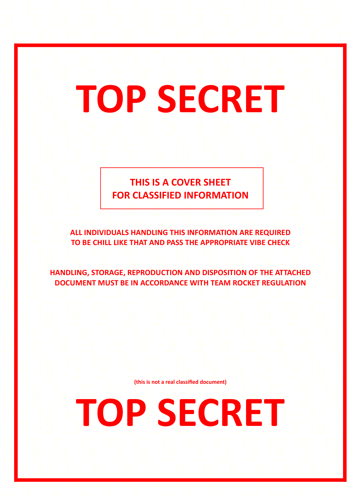

# Straight Outta The SCIF

## 题目简述

附件是一份 15 页的“机密文件”PDF。高分辨率观察页面时，可以在白色背景上看到规则重复的淡黄色点阵：



这些点不是压缩噪声，而是彩色激光打印机使用的 Machine Identification Code，也常称为打印机追踪点。每页的点阵可以携带日期、时间和打印机序列号。题目使用
[DEDA](https://github.com/dfd-tud/deda) 为每页写入一个六位“序列号”，并把 flag 分散在 15 页中。

## 解题过程

### 逐页提取追踪点

先把 PDF 拆成单页，或以至少 300 DPI 将每页无损渲染为 PNG。过低分辨率、JPEG 重压缩或自动去黄都会破坏微小点阵：

```bash
pdfseparate top-secret-team-rocket.pdf page-%02d.pdf
pdftoppm -png -r 300 top-secret-team-rocket.pdf page
```

然后逐页运行 DEDA 的解析器：

```bash
deda_parse_print page-01.png
deda_parse_print page-02.png
# 依次处理至第 15 页
```

DEDA 输出的其他打印信息不是本题目标；按页记录 `serial` 字段，得到：

```text
850077 680067 840070 000123 670079
770077 790078 950084 690065 770095
820079 670075 690084 950076 000125
```

### 将序列号还原为 ASCII

每个六位字段由两个宽度为 3 的十进制 ASCII 码拼接。例如：

```text
850077 -> 085, 077 -> U, M
680067 -> 068, 067 -> D, C
950084 -> 095, 084 -> _, T
```

`000` 是只携带一个字符时的占位值，应忽略。因此
`000123` 给出 `{`，`000125` 给出 `}`。按 PDF 页序连接全部字符：

```python
serials = [
    "850077", "680067", "840070", "000123", "670079",
    "770077", "790078", "950084", "690065", "770095",
    "820079", "670075", "690084", "950076", "000125",
]

result = ""
for serial in serials:
    serial = serial.zfill(6)
    for part in (serial[:3], serial[3:]):
        value = int(part)
        if value:
            result += chr(value)

print(result)
```

输出为：

```text
UMDCTF{COMMON_TEAM_ROCKET_L}
```

## 方法总结

- 核心技巧：高分辨率保留并解析 PDF 每页的黄色打印机追踪点，再把序列号字段按两组三位十进制 ASCII 重组。
- 识别信号：打印/扫描语境下，整页规律重复的微小黄点应优先联想到 Machine Identification Code，而不是普通水印或 LSB。
- 复用要点：页序就是字符序；渲染必须保留颜色与分辨率，并对每页单独记录 DEDA 字段。`000` 仅是占位，不能转成 NUL 混入 flag。
