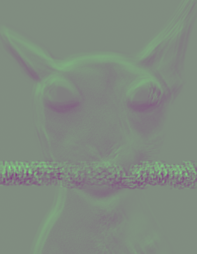

# UMDCTF 2025 - alien-transmission

## 题目简述

附件是一张仍能隐约看出猫脸、中央文字被卷积噪声覆盖的 PNG。生成源码把灰度原图与一个 $19\times19$ 随机核做二维卷积，只保留有效区域，再把结果线性映射到 8 位图像的绿色通道。



随机核使用固定种子 `420` 生成，因此这不是未知核盲猜题；关键是重建核、撤销数值映射，再执行图像反卷积。

## 解题过程

生成器的核元素来自 `random.randint(-10, 10)`，随后除以所有元素之和。对原图 $I$ 和归一化核 $K$，输出本质上为：

$$
Y=I*K.
$$

卷积只遍历距边缘至少 9 像素的位置，所以输出宽高各减少 18。结果先按区间 $[-10,10]$ 映射到 $[0,256]$，取整为 `uint8`，并写入 RGB 的绿色通道。

恢复时必须使用与生成端一致的种子，并将核翻转以匹配反卷积函数采用的卷积方向：

```python
random.seed(420)
kernel = np.flip(np.array([
    [random.randint(-10, 10) for _ in range(19)]
    for _ in range(19)
], dtype=float))
kernel /= kernel.sum()

img = imread("output.png")[:, :, 1].astype(float)
img = np.interp(img, (0, 256), (-10.0, 10.0))
recovered = restoration.unsupervised_wiener(img, kernel)[0]
```

`unsupervised_wiener` 会在估计图像与噪声统计的同时抑制直接逆滤波产生的频域放大。显示恢复结果时应使用图像自身的最小值和最大值拉伸对比度；文字区域随即可以辨认。

恢复出的 flag 为：

```text
UMDCTF{gl33p_gl0rp}
```

## 方法总结

- 核心技巧：根据固定 PRNG 种子重建卷积核，对保存信号的绿色通道撤销线性映射，再做无监督 Wiener 反卷积。
- 识别信号：图像整体仍保留轮廓，但局部呈现卷积拖影；源码中核尺寸、种子和输出通道均已固定。
- 复用要点：反卷积前要核对核的翻转方向、通道和数值范围。直接对 `uint8` 像素或错误方向的核做逆滤波，通常只会放大噪声。
