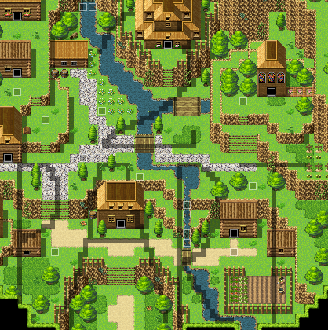
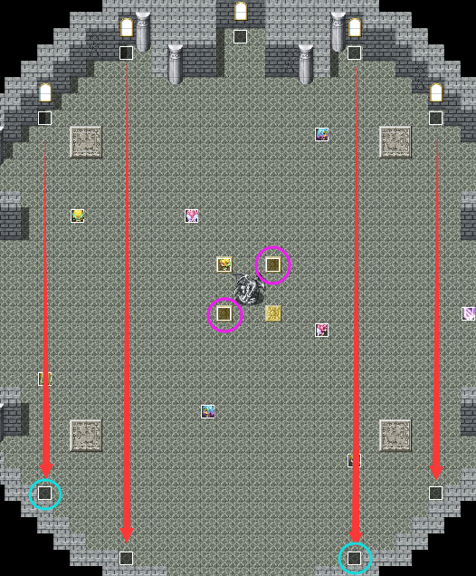
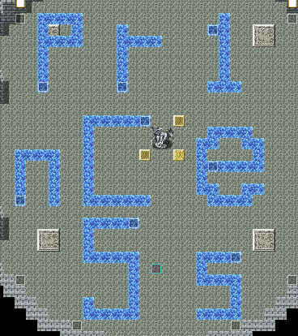
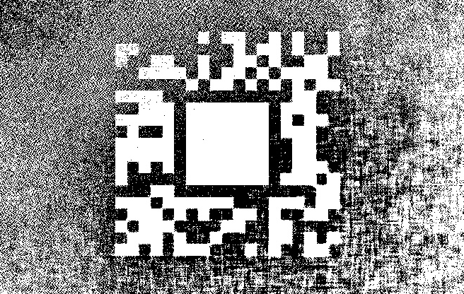

# Dalabengba

## 题目简述

本题是 RPG Maker MV 游戏取证/解谜题，flag 被拆成三段，格式为 `WMCTF{part1+part2=part3}`。附件是一个打包后的 RPG 游戏，需要先用 EnigmaVBUnpacker 解包，再恢复 RPG Maker MV 资源加密 key。三段分别来自游戏地图机关、图片盲水印和加密隐藏文本：part1 通过神殿人物移动轨迹得到，part2 从 `part2.jpg` 的 Java 盲水印中提取 Aztec 码得到，part3 用剧情中恢复出的密码解开 `s3cr3t.crypto` 后再解析空白字符隐写得到。

## 解题过程

### 前言

整道题目的背景为达拉崩吧这首歌，在出题之前就想弄一道rpg的游戏题，苦于没有什么好的剧情构思，于是想到了达拉崩吧，非常完美的勇者斗恶龙剧情（手动滑稽），游戏中一些地图的设计和游戏剧情的构思都较完整的还原了达拉崩吧，所以其实在做题中没什么思路的时候可以去看看歌词对照一下2333

### 题目描述

游玩游戏并获取 flag！

flag 被分成三部分，格式为 **WMCTF{part1+part2=part3}**。

### 题目详解

下载附件解压，可得一个exe文件，打开后发现报错，无法运行，所以首先我们需要将文件解包，检查其不可运行的原因，解题具体过程如下

#### 解包

关于rpg游戏的解包，百度（谷歌）即可，我用到工具为 **EnigmaVBUnpacker** 。不过需要注意的是在解包后需要先修改文件夹的名称，不然含有 `%` 会导致游戏无法正常运行，其中 **part2.jpg** 和 **s3cr3t.crypto** 两个文件分别对应了flag的part2、part3两部分。也就是说，解包后不只是为了运行游戏，还要保留这两个文件作为后续图像水印和隐藏文本解密的输入。

#### 求key

解包后就可以看到一个完整的rpg游戏的内部文件结构了，打开 **www** 文件夹，其中全部都是有关游戏的文件，再打开其中的 **img** 或者 **audio** 可以发现其中文件都被加密，而有关加密的key信息在 **data** 文件夹的 **System.json** 中，打开后翻到最后发现 `encryptionKey` 一项中为空，所以需要先求得key

有关rpg文件解密，有相关工具 **RPG-Maker-MV-Decrypter** ，在GitHub里可以看到 [工具源码](https://github.com/Petschko/RPG-Maker-MV-Decrypter/blob/master/scripts/Decrypter.js)。该源码的关键逻辑是：RPG Maker MV 加密文件前面有 16 字节 fake header，默认签名为 `RPGMV` 相关结构；解密时先移除 fake header，再用 16 字节 `encryptionKey` 与文件开头 16 字节异或恢复原始头。源码中还包含通过 PNG 标准头与加密后头部异或来探测 key 的逻辑，这正好对应本题求 key 的做法。

源码中相关常量可以概括为：

```javascript
Decrypter.prototype.defaultHeaderLength = 16;
Decrypter.prototype.defaultSignature = "5250474d56000000";
Decrypter.prototype.defaultVersion = "000301";
Decrypter.prototype.defaultRemain = "0000000000";
```

而后属于原本文件的开头16字节与key进行异或，即完成了文件加（解）密。解密循环的本质就是把加密文件第 17 到 32 字节与 16 字节 key 逐字节异或，还原原始文件头。

其中key也是长度为16字节，所以用rpgmaker新建一个项目，找到其中任意一个对应未被加密的文件，用其开头16字节与被加密文件的开头17~32字节xor，即可得到key

```python
a = '4F 67 67 53 00 02 00 00 00 00 00 00 00 00 04 EE'.replace(' ','')
b = 'B8 22 F5 61 8A 14 8C F8 58 E7 27 00 78 D4 F2 45'.replace(' ','')

key = ''
for i in range(0,len(a),2):
    key += hex(int(a[i:i+2],16) ^ int(b[i:i+2],16))[2:].zfill(2)

print key

# f74592328a168cf858e7270078d4f6ab
```
将得到的key写到 `encryptionKey` 中，即可正常打开游戏
#### 游戏剧情

剧情大体和达拉崩吧中所描述的相同，首先诞生在城镇，去王宫和国王对话结束后即可开启冒险，其中城镇的 **道具商店** 中有一个hint，在最后会用到（不知道影响也不大）

道具商店中的提示大意是前几天有人打听过巨龙的鳞片，这对应后面用 **巨龙的鳞片** 触发魔女传送到空中神殿的剧情。

总体路线为：城镇 → 森林 → 洞窟 → 美丽村庄 → 山洞 → 巨龙城堡

其中森林、洞窟、山洞、巨龙城堡都会遇到怪，怪的数量很多但大多数都可以逃跑（只有少数我自己加的怪无法逃跑2333），可以用CE修改器等外挂软件闯关，也可以手动闯关，其中在洞窟那个地图中有四根柱子，需要在每根柱子前按下确定键，才能激活通向下一个地图的传送门

我制作游戏时用的是 **rpg maker mv** ，用其新建一个项目，将解包得到的data文件夹替换新建项目的data文件夹，再打开项目也可以看到游戏的整体设计，但是一些关键信息都被加密，无法直接查看，只有在游戏中可以看到，或者想办法把它解密（就是不玩游戏的非预期解）

偏远美丽村庄中每一间能看到门房子都可以进去，其中宝箱里含有part2的hint，编号①~⑦，组合可以得到

```plain
Do you know java
```
地图上也能看到part2的字样，提示此地图中含有part2相关的信息


最后在巨龙城堡3F打败巨龙（不用挂也可以打败）得到道具 **巨龙的鳞片** ，再和公主对话后就会被传送回王宫，和国王对话可得到关键信息

```plain
dwssap:54651A6252C6f5f653f55E62704f55F70395
你需要先删去其中的大写字母
```
其中 `dwssap` 是 `passwd` 的倒序，逆序后去除大写字母，再 `decode('hex')` ，即可得到passwd
```plain
Y0u_@re_5o_bRaVE
```
这个passwd用来解 **s3cr3t.crypto**
#### part1

再去 **道具商店** 即可看到魔女（之前在道具商店提到过hint），和魔女对话上交 **巨龙的鳞片** 后可以传送到 **空中神殿** ，进入神殿内部，观察8个人物行走路径，可以得到 **part1** 部分flag，其中也有两个关于这部分flag的hint

触发hint条件：踩龙雕塑周围四个地砖中被圈起来的两个（要按确认键）

```plain
如果没有什么头绪，不妨去镜子里看看帅气的自己！
镜子有几面呢？
```
在可以看到的五面镜子前按确认键都没有hint，所以想到在五面镜子的对面


在两个蓝色圈处按确认键即可分别得到这两个hint

人物行走轨迹如下图



再结合hint，得到part1部分： `Pr1nCe5s` （有些不太明显，多试几次就好）

当然这部分flag在替换data的新建项目中可以直接查看，人物行走路径的指令并没有被加密，所以可以直接根据指令将flag在地图中画出来（如上图），设计那些hint机关是为了给纯游戏（做题）的师傅们带来更好的游戏体验

#### part2

本部分flag的考点为 **水印盲提取** ，在出这道题的时候，还没有进行安恒六月赛，在六月赛中给出了一道水印盲提取的题，用那道题的工具可以模模糊糊的看到本题图片中加了水印，结合在村庄中得到的hint： `Do you know java` ，在Google搜索 **java 盲水印** ，可以在GitHub上找到一个 [项目](https://github.com/ww23/BlindWatermark)。该项目是 Java 实现的图片盲水印工具，支持 DCT/DFT 变换域嵌入和解码；本题使用 DCT 解码模式，即 `decode -c`，从 `part2.jpg` 中恢复出一个缺少中心识别码的 **Aztec码**。

```plain
java -jar BlindWatermark-master-v0.0.3.jar decode -c part2.jpg out.jpg
```


将中心识别码补好后在线网站扫描，即可得到part2： `W@rR1or`

#### part3

文件后缀为 `crypto` ，Google搜索可知是用 **Encrypto** 这个工具加密，用刚刚得到的passwd解密后得到 **s3cr3t.hidden** 这个文件。`s3cr3t.hidden` 不是普通明文，直接Google关键词 `s3cr3t` ，就可以在GitHub上查到这个 [项目](https://gist.github.com/aanoaa/1408846)。这个项目对应一种用空白字符表示二进制位的隐藏文本方案；本题即使不使用脚本，也可以把两种空白字符分别映射为 `1` 和 `0`，再做逆序二进制解码恢复 part3。

使用 `s3cr3t` 脚本解密后终端输出会提示：

```text
You have found it!!!!!!
part3: WhrRrrr~
```

当然如果没get到工具的话也可以手撕加密（有好几支做出来的队伍都是手撕出来的，我也从中学习了下手撕的方法2333）

文本中有两种空白字符，分别替换成1和0，可以得到

```plain
100110101111011010101110000001000001011010000110011011101010011000000100011001101111011010101110011101100010011000000100100101100010111010000100100001001000010010000100100001001000010001010000
01010000
01010000
01010000
000011101000011001001110001011101100110001011100111010100001011001001110010010100100111001001110010011100111111001010000
```
逆序解二进制，将得到结果再逆序，即可完成解密
#### flag

最终将得到的三部分flag按照格式拼在一起，即是最终的flag

```plain
WMCTF{Pr1nCe5s+W@rR1or=WhrRrrr~}
```
至于格式中为什么是 `+` 和 `=` ，也是为了更符合达拉崩吧的背景2333
### 总结

整道题比较难的地方在于最开始求得 `encryptionKey` ，之后的考点在网上都可以直接搜到，只要有足够的时间，完全可以解决本题，当然享受游戏也不失为一种 解 题方式

## 方法总结

RPG Maker MV 游戏题的第一步是解包和恢复资源 key：如果 `System.json` 中 `encryptionKey` 为空，可以用已知文件头与加密资源头部异或反推 key。后续要把游戏剧情提示和附件 artifact 对上：`part2.jpg` 对应 Java 盲水印和 Aztec 码，`s3cr3t.crypto` 对应 Encrypto 密码和空白字符隐写，地图机关则可以通过实际游玩或打开 RPG Maker 项目读取事件路径。遇到这种多段 flag 题，优先把每段的来源、提示、工具和验证结果拆清楚。
