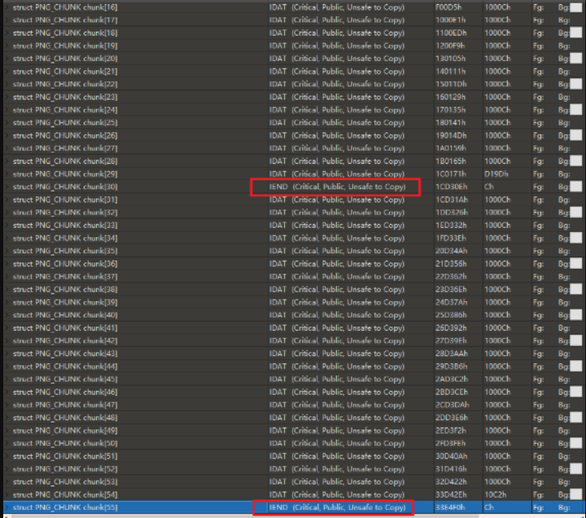
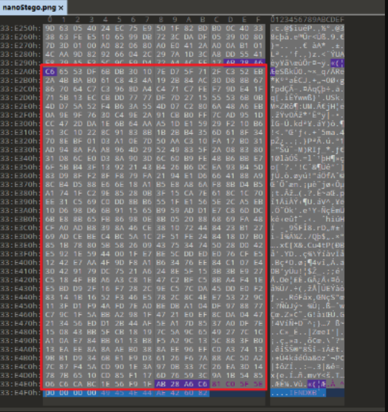
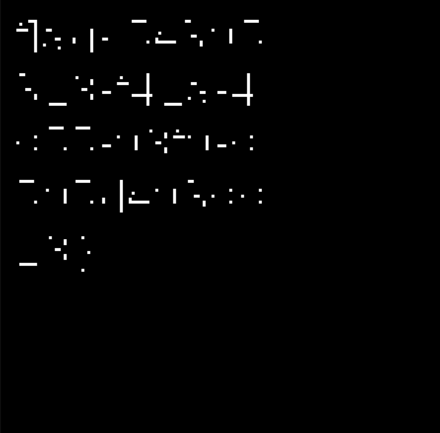

# nanoStego

## 题目简述

题目附件是 `nanoStego.png`，题面提示为 QWB2022 `embryo_Img_stego` 的 revenge。图片内有两层结构：一是 PNG 文件中出现两个 `IEND` chunk，可先拆出两个 PNG；二是 `IDAT` 压缩数据后拼接了 zlib 可解压的额外数据，能提取出生成水印用的 Python 脚本和 `.ttf` 字体。脚本实现了带 Arnold 猫映射的盲水印，但还存在类型转换导致水印弱像素丢失的问题，需要枚举参数并用同字体逐字符匹配恢复 flag。

## 解题过程

1、找到两个IEND PNG_CHUNK，分割得到两个png文件。

2、检查IDAT PNG_CHUNK。根据PNG的结构，通过对IDAT内的数据进行连接和解压，可以得到原始图像数据。然而，zlib是用来解压的，它并不关心原始图像数据后面的额外数据。注意到这一点，你就可以解压这部分，得到一个Python脚本和一个.ttf字体。

例如：图像中被框住的部分是Python脚本的压缩位置。

3、解出的 Python 脚本实现了一个盲水印流程：使用字体把文字渲染成水印图，再通过 Arnold 猫映射打乱水印坐标并叠加到载体中。因此需要根据该脚本反写盲水印解码程序，而不是只做 PNG 容器分离。

4、有一个解码程序是不够的。盲水印的实现还涉及到阿诺德的猫图，我们需要A和B的值。水印的大小是 $150\times150$，所以 $0\le A,B<150$。

试着列举出A和B的值来进行解码。当A和B的值都不对时，你会得到一个随机的图像。但当A或B的值正确时，你可以看到一些有图案的图像。

经过这一步，我们可以得到A和B的正确值。

5、最后你会得到这个水印。但是为什么我们看不到flag呢？这是因为L43的代码做了一个类型强制转换，导致水印中值为255的像素被保留，而其他低于255的像素值被平移为0。

6、如何解决这个问题？我们可以从短到长不断地猜测flag。用相同的参数和相同的字体文件在图像上打印所有候选前缀，计算候选水印与当前水印的像素匹配数，选择匹配数最高的前缀继续扩展，最终恢复完整 flag。

## 方法总结

本题核心是连续拆 PNG 容器和盲水印算法。先按 PNG chunk 结构找双 `IEND`，再对 `IDAT` 正常图像数据后的额外 zlib 数据解压，拿到脚本和字体，最后反写盲水印解码器。

识别信号是：一个 PNG 内存在多个 `IEND`；`IDAT` 解压得到图像数据后仍有可继续解压的数据；提取出的脚本包含 Arnold cat map、字体渲染和水印叠加逻辑。

复现时先枚举 $0\le A,B<150$ 找到能形成稳定图案的 Arnold 参数，再注意脚本中的强制类型转换会把非 255 的低强度像素压成 0，直接看水印未必可读。可靠办法是使用相同字体和参数从短到长猜测 flag 前缀，比较生成图与水印图的像素匹配数。
