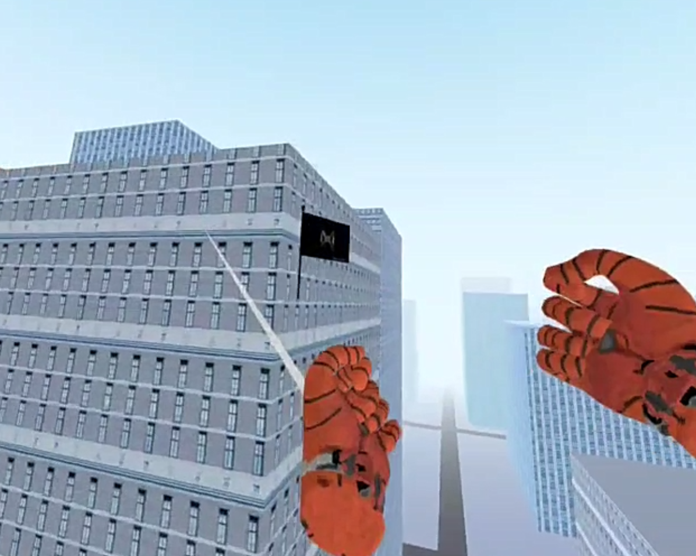
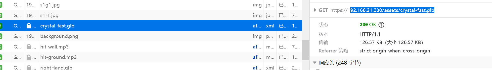
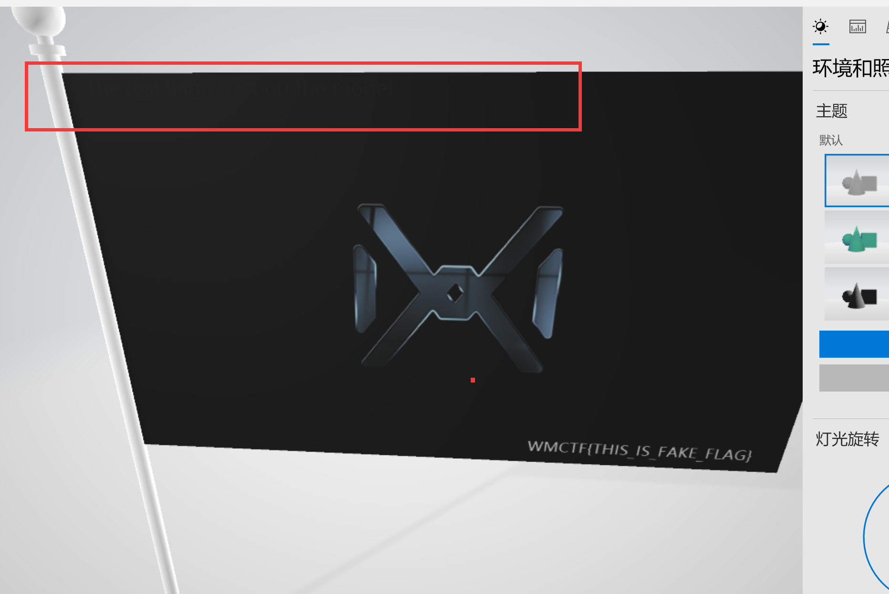
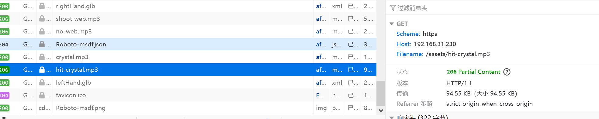
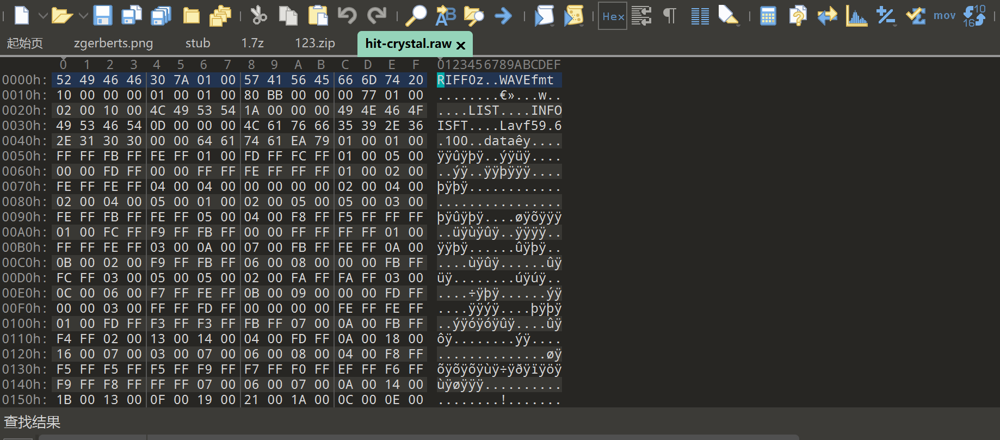
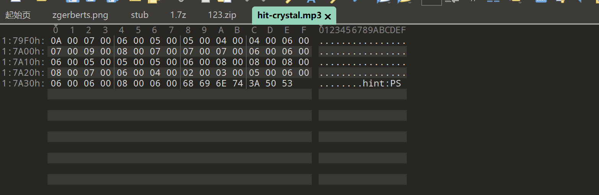
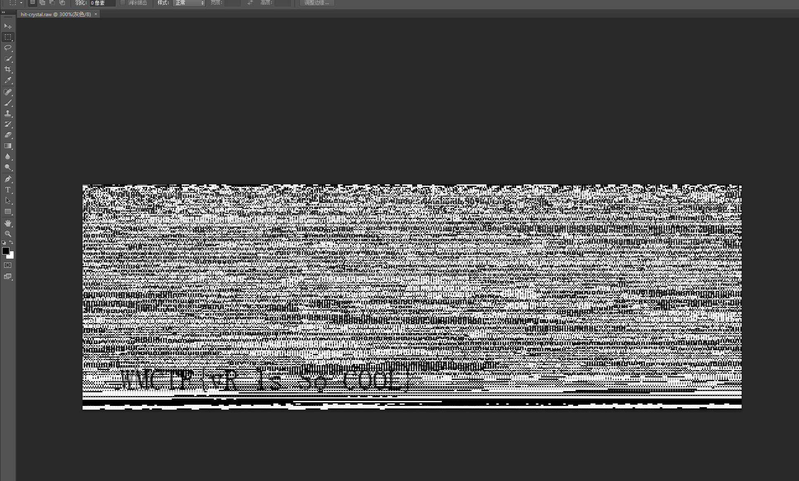

# spider-man

## 题目简述

题目是一个 VR/网页游戏，表面目标是在游戏里“物理拿到 flag”。实际进入游戏后确实能看到一个 flag 模型，触碰后也会播放获得音效，但音效尾部存在异常杂音，说明可见模型只是引导。真正解题点在网页资源：通过浏览器开发者工具找到模型和音频资源，确认 `hit-crystal.mp3` 是触碰 flag 时播放的声音；该文件扩展名伪装成 mp3，实际可按 wav/raw 数据处理，尾部音频数据导入图像软件后显示 flag。

## 解题过程

1. VR 游戏，有 VR 设备可以直接进行游玩；没有设备时也可以从网页资源和交互逻辑入手。

2.根据开始描述，说是要拿flag（物理），进入游戏蛛丝飘荡确实看见了真正的flag

3.装上去，会触发flag获得音效，但是可以挺到最后是有一声杂音的，说明这里有问题。

4.想办法提取杂音，直接f12侦擦网络，查看关键信息

5.可以提取glb文件看看模型详细内容

7.左上角可以隐约看见文字，说明模型里出现的“flag”更像诱饵或提示，真正内容应继续看触发音频。

8.发现一个叫做hit-crystal的mp3，发现是撞击flag后的杂音，拿下来分析

9.mp3下载后通过au可以看见最后的杂音，但是没有规律可循，通过010打开可以发现文件头和数据结构更接近 wav/raw 音频，而不是标准 mp3。

10.可以在最后看见提示，ps

11. wav/raw 音频的采样字节可以按灰度图像导入 Photoshop。把文件修改后缀为 `.raw`，按合适宽高和灰度模式导入，即可在图像底部看到 flag 字符。

## 方法总结

本题核心是不要停在游戏内可见 flag。触碰模型后的音效尾部出现杂音，结合开发者工具中 `hit-crystal` 资源，说明真正数据藏在音频文件里。

识别信号是：VR 场景中的物理 flag 过于直接、触发音效尾部异常、资源名和交互事件能对应到 `hit-crystal`、文件扩展名与实际内容不一致。

复现时先用浏览器开发者工具下载触发音频，再用音频编辑器定位异常尾部，用十六进制工具确认文件类型。最后把 wav/raw 数据按灰度图导入图像软件，通过调整宽度和显示比例读取 flag。
