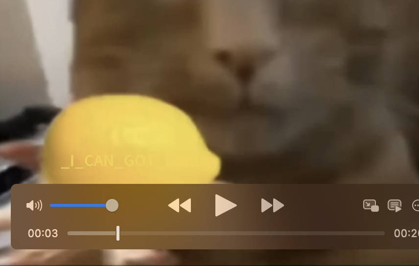
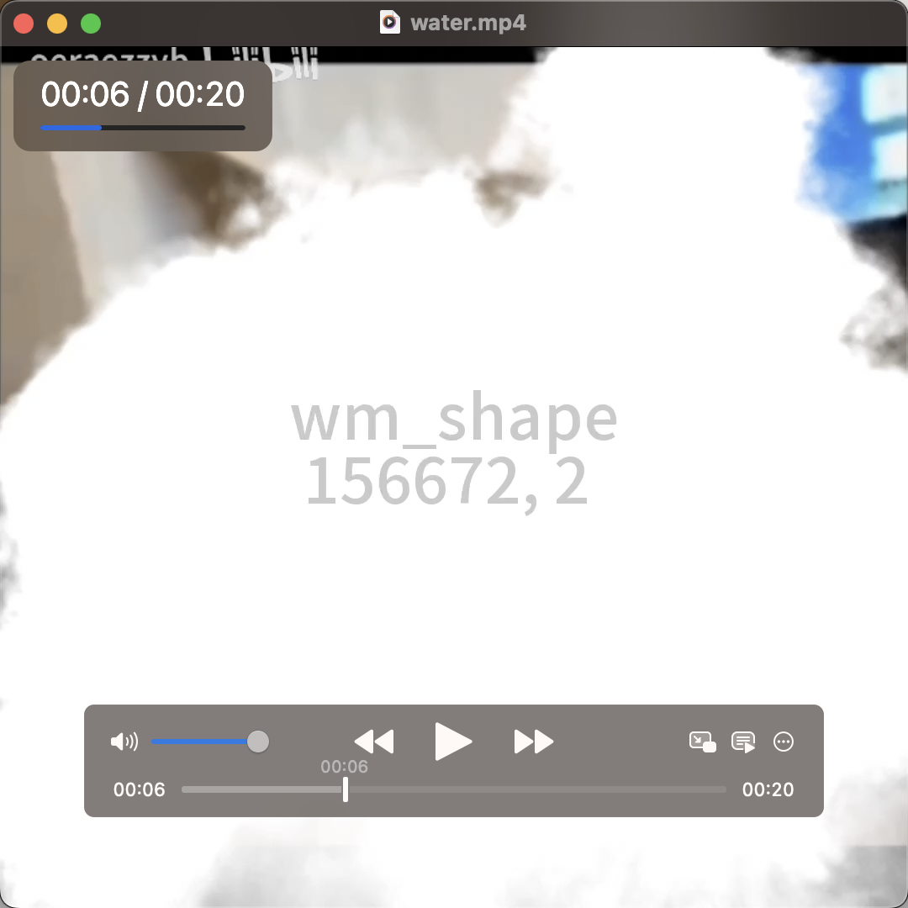
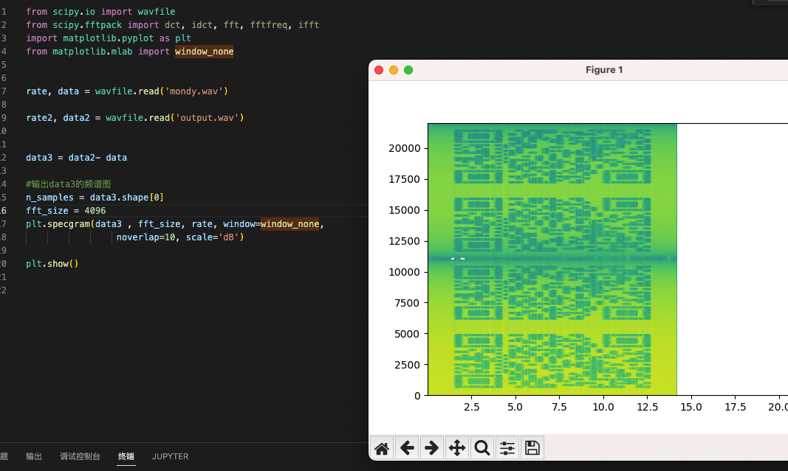

# Money left me broken

## 题目简述


原始方向为 `Steg`；归档时按主要障碍归入 `forensics`，因为解法主体是视频置乱恢复、音频水印提取和媒体载体取证。

题目同时包含视频置乱和音频水印。视频画面经过 Arnold 变换类置乱，恢复后能看到一段 flag 和 watermark 参数；音频部分需要找到原始未加水印视频，提取原始音频与题目音频作差，再根据频谱中的 DCT watermark 信息得到另一段 flag。

## 解题过程

先获取 mkv 视频。视频内容看起来像猫脸变形，参数未知，可先根据画面扰动估计参数范围，大致在 1~10 之间。

先提取一帧并写脚本做穷举：

```python
import numpy as np
from PIL import Image
import cv2


im = Image.open('frame2.jpg')
im = np.array(im)


def dearnold(img):
    r,c,t = img.shape
    p = np.zeros((r,c,t),dtype=np.uint8)

    for a in range(1, 11):
        for b in range(1, 11):
            for i in range(r):
                for j in range(c):
                    for k in range(t):
                        x = ((a*b+1)*i - b*j)%r
                        y = (-a*i + j)%r
                        p[x,y,k] = img[i,j,k]
            filename = f'new/dearnold{a}_{b}.jpg'
            cv2.imwrite(filename, p)
            print('dearnold{}_{}'.format(a, b))
    return p

dearnold(im)
```

当 `a`、`b` 都为 `5` 时可还原出原图。

接着按帧恢复视频：

```python
def dearnold(img):
    r,c,t = img.shape
    p = np.zeros((r,c,t),dtype=np.uint8)
    a = 5
    b = 5
    for i in range(r):
        for j in range(c):
            for k in range(t):
                x = ((a*b+1)*i - b*j)%r
                y = (-a*i + j)%r
                p[x,y,k] = img[i,j,k]
    return p

video   = "output2.mp4"
cap     = cv2.VideoCapture(video)
fps     = cap.get(cv2.CAP_PROP_FPS)
size    = (int(cap.get(cv2.CAP_PROP_FRAME_WIDTH)), int(cap.get(cv2.CAP_PROP_FRAME_HEIGHT)))
fourcc  = cv2.VideoWriter_fourcc(*'mp4v')
out     = cv2.VideoWriter('return.mp4', fourcc, fps, size)
pbar    = tqdm.tqdm(total=int(cap.get(cv2.CAP_PROP_FRAME_COUNT)))


ret, frame = cap.read()
while ret:
    ret, frame = cap.read()
    if ret:
        frame = dearnold(frame)
        out.write(frame)  # 将处理后的帧写入新的视频文件
        pbar.update(1)
    else:
        break

cap.release()
out.release()
```

原视频可恢复，并在视频中发现了两个明显位置：



第一段 flag 可见：

_I_CAN_GOT_both}

和



以及 watermark 的参数。

结合题目内容和音频噪声，可判断这是 audio dct chunking 隐写。

不过该 watermark 需要原始音频，根据视频左上角 watermark 提示可直接找到原视频地址：

[【猫猫meme】Lémǒn（Monday Left Me Broken）_哔哩哔哩_bilibili](https://www.bilibili.com/video/BV1Fh4y1M79t/?spm_id_from=333.337.search-card.all.click)

这个外链的关键作用是提供原始未嵌入水印的参考视频/音频。拿到原始音频后，才能和题目音频相减得到水印残差信号；如果只看题目视频本身，很难直接从混合音频中分离 DCT watermark。

下载原始音频并做 dct watermark 提取：

```
from scipy.io import wavfile
from scipy.fftpack import dct, idct, fft, fftfreq, ifft
import matplotlib.pyplot as plt
from matplotlib.mlab import window_none


rate, data = wavfile.read('mondy.wav')

rate2, data2 = wavfile.read('output.wav')


data3 = data2- data

#输出data3的频谱图
n_samples = data3.shape[0]
fft_size = 4096
plt.specgram(data3 , fft_size, rate, window=window_none,
                 noverlap=10, scale='dB')

plt.show()
```

可以看到被切成四段，并且 alpha multiplier 为 0.1，得到：



虽然可以继续编写脚本提取 dct，但这些内容是可见的，直接按扫频结果处理即可。

得到第二段 flag：

WMCTF{Video_Audio

最终 flag：WMCTF{Video_Audio_I_CAN_GOT_both}

## 方法总结

- 核心技巧：先用 Arnold 逆变换恢复视频，再用原始音频作差提取 DCT watermark。
- 识别信号：视频画面呈周期性扭曲、题名或画面提示原始素材来源、音频存在噪声时，应考虑“视频置乱 + 音频水印”双层隐写。
- 复用要点：音频水印题常需要原始载体作为参照；WP 中必须说明外链原始素材的作用，而不是只保留视频链接。
