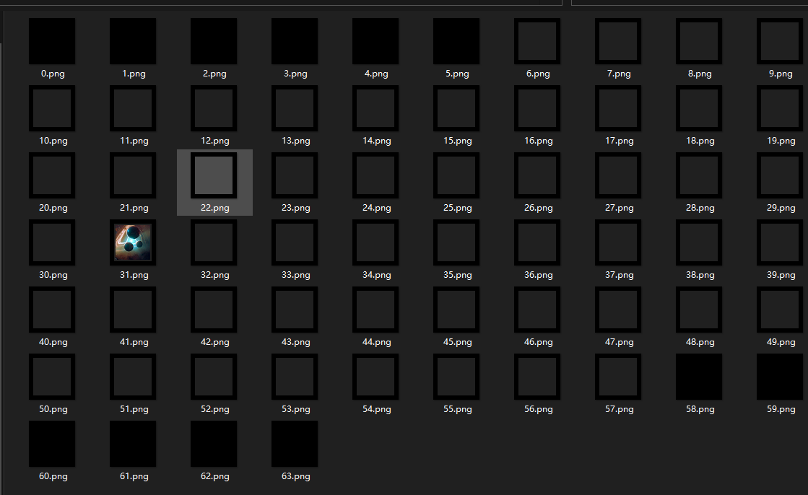

# perfect two-way foil

## 题目简述

原始方向为 `Steg`；归档时按主要障碍归入 `forensics`，因为解法主体是图像空间重排还原、切片恢复和 LSB 隐写提取。

题目给出一张具有 Hilbert 曲线特征的 `512 * 512` 图片。结合“双向黑盒”和 RGBA/黑色区域特征，可以推测图片是一维 Hilbert 遍历序列和三维体数据之间的重排结果。解法是用二维 Hilbert 曲线按顺序取出像素，再按三维 Hilbert 曲线还原成 `64 * 64 * 64` 体数据，逐层切片后继续做 LSB 隐写分析。

## 解题过程

先看题目名称，图片本身明显带有 Hilbert 曲线特征，因此可以先猜测为 Hilbert 曲线，并确认图像尺寸为 `512 * 512`。  
再结合题目中“双向黑盒”的提示，以及图像里大量黑色区域和 RGBA 通道信息，可推测要把 Hilbert 点的二维重排还原为三维对象，再将有颜色的像素取出还原最终内容。最终脚本如下：

~~~python
import numpy as np
import matplotlib.pyplot as plt
from mpl_toolkits.mplot3d import Axes3D
from PIL import Image

def _hilbert_3d(order):
    def gen_3d(order, x, y, z, xi, xj, xk, yi, yj, yk, zi, zj, zk, array):
        if order == 0:
            xx = x + (xi + yi + zi)/3
            yy = y + (xj + yj + zj)/3
            zz = z + (xk + yk + zk)/3
            array.append((xx, yy, zz))
        else:
            gen_3d(order-1, x, y, z, yi/2, yj/2, yk/2, zi/2, zj/2, zk/2, xi/2, xj/2, xk/2, array)
            gen_3d(order-1, x + xi/2, y + xj/2, z + xk/2, zi/2, zj/2, zk/2, xi/2, xj/2, xk/2, yi/2, yj/2, yk/2, array)
            gen_3d(order-1, x + xi/2 + yi/2, y + xj/2 + yj/2, z + xk/2 + yk/2, zi/2, zj/2, zk/2, xi/2, xj/2, xk/2, yi/2, yj/2, yk/2, array)
            gen_3d(order-1, x + xi/2 + yi, y + xj/2 + yj, z + xk/2 + yk, -xi/2, -xj/2, -xk/2, -yi/2, -yj/2, -yk/2, zi/2, zj/2, zk/2, array)
            gen_3d(order-1, x + xi/2 + yi + zi/2, y + xj/2 + yj + zj/2, z + xk/2 + yk + zk/2, -xi/2, -xj/2, -xk/2, -yi/2, -yj/2, -yk/2, zi/2, zj/2, zk/2, array)
            gen_3d(order-1, x + xi/2 + yi + zi, y + xj/2 + yj + zj, z + xk/2 + yk + zk, -zi/2, -zj/2, -zk/2, xi/2, xj/2, xk/2, -yi/2, -yj/2, -yk/2, array)
            gen_3d(order-1, x + xi/2 + yi/2 + zi, y + xj/2 + yj/2 + zj , z + xk/2 + yk/2 + zk, -zi/2, -zj/2, -zk/2, xi/2, xj/2, xk/2, -yi/2, -yj/2, -yk/2, array)
            gen_3d(order-1, x + xi/2 + zi, y + xj/2 + zj, z + xk/2 + zk, yi/2, yj/2, yk/2, -zi/2, -zj/2, -zk/2, -xi/2, -xj/2, -xk/2, array)

    n = pow(2, order)
    hilbert_curve = []
    gen_3d(order, 0, 0, 0, n, 0, 0, 0, n, 0, 0, 0, n, hilbert_curve)

    return np.array(hilbert_curve).astype('int')

def _hilbert_2d(order):
    def gen_2d(order, x, y, xi, xj, yi, yj, array):
        if order == 0:
            xx = x + (xi + yi)/2
            yy = y + (xj + yj)/2
            array.append((xx, yy))
        else:
            gen_2d(order-1, x, y, yi/2, yj/2, xi/2, xj/2, array)
            gen_2d(order-1, x + xi/2, y + xj/2, xi/2, xj/2, yi/2, yj/2, array)
            gen_2d(order-1, x + xi/2 + yi/2, y + xj/2 + yj/2, xi/2, xj/2, yi/2, yj/2, array)
            gen_2d(order-1, x + xi/2 + yi, y + xj/2 + yj, -yi/2, -yj/2, -xi/2, -xj/2, array)

    n = pow(2, order)
    hilbert_curve = []
    gen_2d(order, 0, 0, n, 0, 0, n, hilbert_curve)

    return np.array(hilbert_curve).astype('int')
# Generate 3D Hilbert curve for order 3
curve = _hilbert_3d(6)
curve_2 = _hilbert_2d(9)

p = np.array(Image.open('out_flag.png').convert('RGBA'))
line = []
for i in curve_2:
    line.append(p[i[0], i[1]])
line = np.array(line)
remake_3d = np.zeros((64,64,64,4), dtype=np.uint8)
for i in range(len(curve)):
    remake_3d[curve[i][0], curve[i][1], curve[i][2], :] = line[i]

for i in range(64):
    pic = Image.fromarray(remake_3d[:,:,i,:])
    pic.save('res/' + str(i) + '.png')
~~~

切片如下：

在第 31 层可以看到完整图片，放入 stegsolve 后可看到存在 LSB 隐写。

最后放大并扫图即可拿到 flag。

## 方法总结

- 核心技巧：用 Hilbert 曲线在二维图片和三维体数据之间做坐标还原，再对还原切片继续做 LSB。
- 识别信号：图片呈现空间填充曲线纹理、尺寸正好是 $2^n \times 2^n$，且题面暗示“双向/三维”时，应考虑 Hilbert/Z-order 等空间重排。
- 复用要点：还原时必须同时匹配二维阶数和三维阶数；本题中 `512*512 = 64*64*64`，对应二维 9 阶与三维 6 阶。
