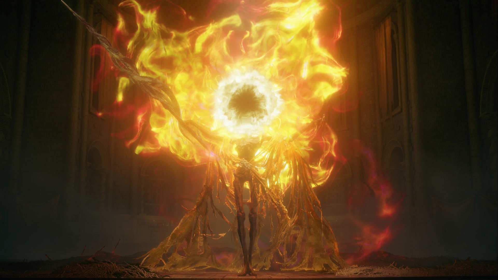

# steg_allInOne

## 题目简述

题目给出 `flag.png`，官方附件提供完整提取脚本。图片中分三层隐藏 flag：

1. 红色通道 LSB。
2. 绿色通道 DWT + QIM。
3. 蓝色通道 DCT + SVD，并且原始蓝色通道藏在额外 IDAT 数据块中。



## 解题过程

### 关键机制

第一层直接读取红色通道最低位，得到第一段 flag 和第二层参数：

```text
delta = 8
second flag length = 253
block size = 8
```

第二层对绿色通道按 $8\times 8$ 分块做 Haar DWT，取 LL 子带均值，用 QIM 的余数区间判 bit：

```python
def extract_qim(block, delta):
    avg = np.mean(block.flatten())
    mod_value = avg % delta
    if mod_value < delta / 4 or mod_value > 3 * delta / 4:
        return "0"
    return "1"
```

第二层提示第三层参数：

```text
alpha = 0.1
block size = 8
third flag length = 83
blue channel original image is hidden somewhere
```

第三层需要提取 PNG 中异常 IDAT chunk，zlib 解压后再 base64 解码，得到蓝色通道原图。随后比较水印蓝色通道与原始蓝色通道，在每个 $8\times 8$ 块上做 DCT + SVD，通过最大奇异值差异恢复 bit。

### 求解步骤

红色通道：

```python
from PIL import Image
from Crypto.Util.number import long_to_bytes
import numpy as np

p = Image.open("flag.png").convert("RGB")
R = np.array(p)[:, :, 0]
data = R.reshape(-1) % 2
print(long_to_bytes(int("".join(map(str, data)), 2)).replace(b"\x00", b""))
```

绿色通道 DWT + QIM：

```python
import pywt

def extract_watermark1(G, watermark_length, delta=8):
    bits = []
    for i in range(0, G.shape[0], 8):
        for j in range(0, G.shape[1], 8):
            if len(bits) >= watermark_length * 8:
                return bits_to_string("".join(bits))
            block = G[i:i+8, j:j+8]
            if block.shape != (8, 8):
                continue
            LL, _ = pywt.dwt2(block, "haar")
            bits.append(extract_qim(LL, delta))
    return bits_to_string("".join(bits))
```

蓝色通道 DCT + SVD：

```python
import cv2

def extract_watermark2(B_watermarked, B_original, watermark_length):
    bits = []
    for i in range(0, B_watermarked.shape[0], 8):
        for j in range(0, B_watermarked.shape[1], 8):
            if len(bits) >= watermark_length * 8:
                return bits_to_string("".join(bits))
            wm = cv2.dct(B_watermarked[i:i+8, j:j+8].astype(np.float32))
            orig = cv2.dct(B_original[i:i+8, j:j+8].astype(np.float32))
            _, S_wm, _ = np.linalg.svd(wm, full_matrices=True)
            _, S_orig, _ = np.linalg.svd(orig, full_matrices=True)
            bits.append("1" if S_wm[0] - S_orig[0] == 0 else "0")
    return bits_to_string("".join(bits))
```

## 方法总结

- 第一层给参数，第二层给第三层参数，必须按顺序解。
- 额外 IDAT 块不是普通图片显示信息，而是第三层所需原始蓝色通道。
- 附件 exp 与官方描述一致，可作为最终复现脚本。
