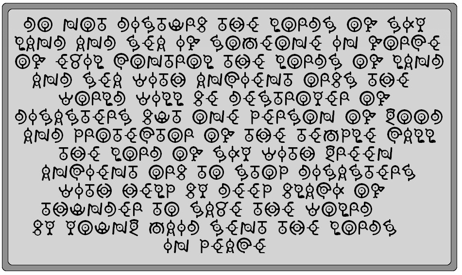

# Smoke and Mirrors

## 题目简述

WelcomeCTF2021 的 Smoke and Mirrors 给出一张 PNG，并说明一个 11,392 字节的 Windows 可执行文件被写入图像像素的最低有效位。像素按行优先顺序遍历，每个像素贡献 1 位。



## 解题过程

PNG 是无损格式，必须先由图像库解码为像素，再读取像素值的最低位；不能直接对压缩后的 PNG 文件字节取最低位。

需要提取的位数为

$$
11392\times 8=91136.
$$

按行优先遍历像素，收集最低位：

```python
from PIL import Image

image = Image.open("image.png")
width, height = image.size
bits = []

for y in range(height):
    for x in range(width):
        bits.append(image.getpixel((x, y)) & 1)
        if len(bits) == 11392 * 8:
            break
    if len(bits) == 11392 * 8:
        break
```

题目按高位到低位写入每个字节，因此每 8 位依次左移拼接：

```python
payload = bytearray()
for offset in range(0, len(bits), 8):
    value = 0
    for bit in bits[offset:offset + 8]:
        value = (value << 1) | bit
    payload.append(value)

with open("flag.exe", "wb") as stream:
    stream.write(payload)
```

输出文件应以 `MZ` 开头，且大小恰为 11,392 字节。可在隔离的 Windows 虚拟机中运行，或先用字符串工具静态检查，得到：

```text
greyhats{m0r3_th6n_m33t5_the_3y3_189794872}
```

仓库 README 的解法段曾写成 `8,648 * 8`，但题面、官方脚本参数和实际载荷均表明正确长度是 `11,392 * 8`，整理时以三者一致的证据为准。

## 方法总结

解题链条是“解码 PNG 像素—按行优先取 LSB—按正确位序组字节—验证 PE 头和长度”。载荷长度是停止条件，少取或多取都会破坏可执行文件。对未知可执行文件应优先静态检查并在隔离环境中运行。
