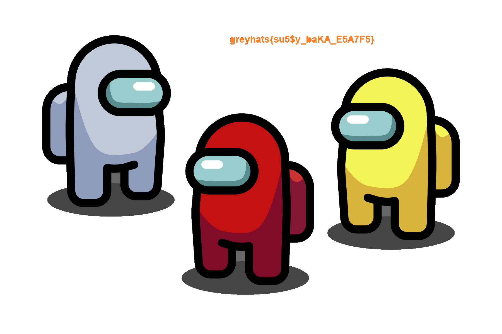

# Amongus

## 题目简述

附件 `amoonguss.png` 能正常显示一张宝可梦图片，但文件在第一张 PNG 的 `IEND` 结束块之后还拼接了另一张完整 PNG。第二张图中，Flag 文字与背景使用相同颜色，必须先提取文件再改变背景才能看见。

## 解题过程

PNG 解码器读取到 `IEND` 后就停止，尾随字节不会影响第一张图的显示。用 `binwalk` 检查并按 PNG 签名雕取内嵌文件：

```bash
binwalk amoonguss.png
binwalk --dd='png image:png:' amoonguss.png
```

提取结果中可以找到第二张 PNG。打开后能看到《Among Us》人物，但橙色背景看似没有文字。用图像编辑器的填充工具把连通的橙色背景改为白色，原本与背景同色的橙色文字便会保留下来：



读取图中文字得到：

```text
greyhats{su5$y_baKA_E5A7F5}
```

## 方法总结

本题串联了两层隐藏：先把完整文件放在 PNG 结束块之后，再用同色文字隐藏视觉内容。对可正常打开的媒体文件也要检查真实文件尾和内嵌签名；提取后的图像若颜色大面积单一，还应检查同色前景、透明度和通道，而不能只凭肉眼第一印象结束分析。
