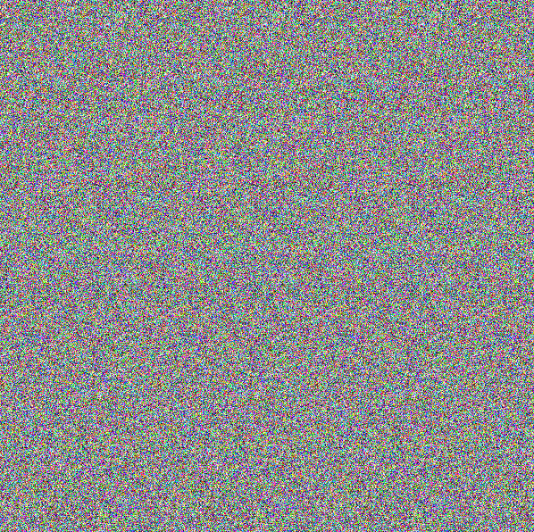

# Grains

## 题目简述

附件表面上是一张彩色随机噪点图，实际是单幅随机点立体图（autostereogram）。图像通过水平方向重复纹理的细微位移编码深度；只有改变双眼会聚焦点，隐藏文字才会以立体轮廓出现。

## 解题过程

原始载体本身承载空间视觉信息，因此予以保留：



观察时不要把焦点落在屏幕表面，可以采用平行视法：先把脸靠近图像，让视线像在看图像后方的远处；保持眼睛放松，再缓慢拉开距离。当相邻重复纹理在视觉中重合后，隐藏字符会从噪点背景中浮现。

如果难以用裸眼稳定观看，也可使用立体图查看器，让工具寻找水平方向的重复周期并生成深度图。两种方法恢复的文字一致：

```text
greyhats{wow_stereograms_are_very_naise}
```

## 方法总结

随机点图不一定是加密数据或像素最低位隐写。若噪点在水平方向存在周期性相似结构，应考虑单幅立体图：纹理位移量对应深度差。此类题的关键证据就是原图的空间关系，不能用纯文本替代；但最终识别出的 Flag 应转写到正文，避免未来只能依赖肉眼再次辨认。
