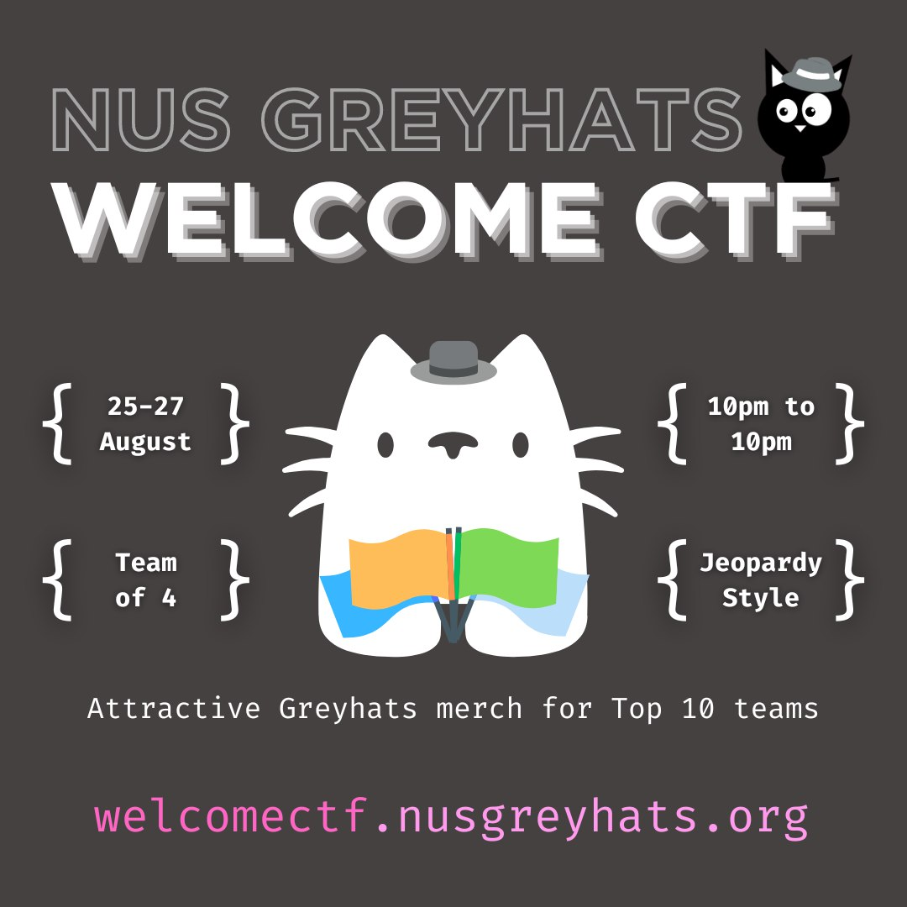

# Baby Cake

## 题目简述

题目把 Flag 分成三段，依次藏在图片元数据、PNG 最低有效位和追加在 PNG 尾部的另一张图片中。每一层还会给出下一层载体或线索，因此需要按“元数据 → LSB → 文件拼接”顺序处理。



## 解题过程

先查看第一张 JPEG 的元数据：

```bash
exiftool welcome-poster.jpg
```

其中 `Make` 字段是一串十六进制：

```text
67726579686174737b746834745f
```

转为 ASCII 得到第一段 `greyhats{th4t_`。`Comment` 字段给出第二层图片的获取线索；归档时已经保留最终载体，不依赖原临时短链接。


对小猫 PNG 提取低两位隐写数据：

```bash
stegolsb steglsb -r -i cat-carrier.png -o lsb-output.bin -n 2
```

输出内容为：

```text
w4s_much_
```

同一文件还包含追加数据。使用 `binwalk` 扫描并提取：

```bash
binwalk --dd='.*' cat-carrier.png
```

在约 `0xF6A22` 偏移处可以识别出另一张 PNG。该图仅写有第三段文字，因此不再保留为图片，直接转写为：

```text
b1g_c4k3}
```

三段顺序拼接后得到：

```text
greyhats{th4t_w4s_much_b1g_c4k3}
```

## 方法总结

- 核心技巧：连续检查 EXIF、像素最低有效位和文件尾部追加数据。
- 识别信号：题面强调“三层”、第一张图片元数据带链接、PNG 文件体积或尾部结构异常。
- 复用要点：每提取一层都要同时检查文本结果和下一层载体；图片里的纯文字结果应转写，隐写载体本身才值得保留。
