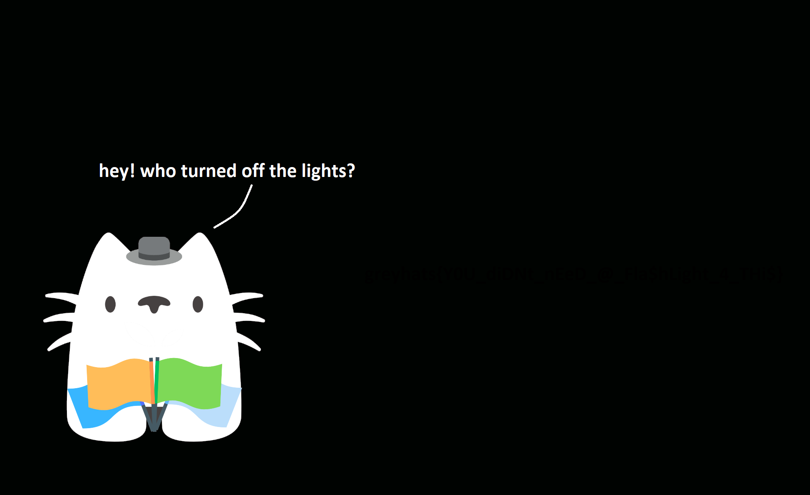

# More than meets the eye

## 题目简述

附件是一张以黑色为主的图片，题面提示“turn the lights on”。Flag 文字的像素值只在低位上与纯黑背景不同，因此默认显示时几乎不可见；这里需要显露低位形成的明暗差，而不是从图像尾部或压缩数据中解出另一份文件。



## 解题过程

用任意图像编辑器或位平面查看器打开载体，选择以下任一方法显露低位差异：

- 用魔棒或按颜色选择精确的纯黑背景，再填充成白色，使非纯黑文字保留下来；
- 调整色阶或曲线，把接近 0 的像素值映射到更亮的范围；
- 单独查看 RGB 通道的低位位平面，文字轮廓会直接出现。

处理后隐藏文字清晰可见。由于结果图只重复显示可直接复制的 Flag，本 WP 不再保留一张纯文字截图，而是转写为：

```text
greyhats{Y0U_diDNt_nEeD_@_Fla$hLight_4_THi$}
```

## 方法总结

- 核心技巧：放大低位像素差异，使近黑色 Flag 与纯黑背景分离。
- 识别信号：图片大面积单色、题面提示光线或亮度、肉眼近似纯黑的区域实际存在多个相邻像素值。
- 复用要点：位平面“看见文字”和从 LSB 重组隐藏文件是两类操作；本题只需显示低位形成的文字轮廓，不需要按位重组载荷。
