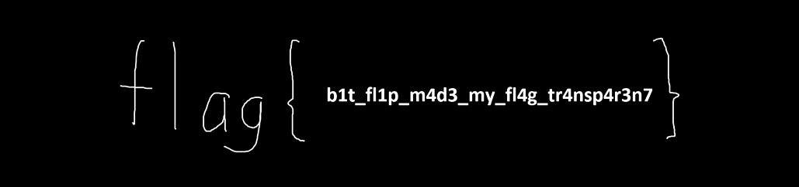

# Cosmic Bit Flip

## 题目简述

附件看起来是一张 1029×242 的随机噪声 PNG。`IHDR` 声明位深为 8、颜色类型为 2，即每像素 3 字节 RGB；但解压后的扫描行呈现稳定的 4 字节节奏，说明实际像素是 RGBA。颜色类型字段被从 6 改成了 2，导致解码器用错误的像素宽度解释数据，Alpha 通道中的 flag 也随之不可见。

## 解题过程

PNG 的颜色类型位于文件偏移 25。把该字节从 `0x02` 改回 `0x06` 后，必须重新计算 `IHDR` 的 CRC；否则严格的解码器会拒绝文件。随后把 Alpha 通道单独导出为灰度图即可清晰读取文字：

```python
from pathlib import Path
import zlib
from PIL import Image

src = Path("flag.png")
fixed = Path("recovered-flag.png")

data = bytearray(src.read_bytes())
assert data[12:16] == b"IHDR"
assert data[25] == 2

data[25] = 6
data[29:33] = (zlib.crc32(data[12:29]) & 0xFFFFFFFF).to_bytes(4, "big")
fixed.write_bytes(data)

image = Image.open(fixed).convert("RGBA")
image.getchannel("A").save("alpha-flag.png")
```

修复后的 RGBA 合成图仍近似随机噪声；真正承载文字的是 Alpha 通道：



读取得到：

```text
flag{b1t_fl1p_m4d3_my_fl4g_tr4nsp4r3n7}
```

颜色类型修复这一主线来自[公开参赛者题解](https://sl-lee.github.io/CTF-Writeups/NUS-Greyhats-Welcome-CTF-2025)；正文进一步写明了 `IHDR` 字节、CRC 更新和 Alpha 通道提取步骤，因此无需依赖外链中的截图。

## 方法总结

- 核心技巧：根据解压像素数据的周期判断真实通道数，修复 PNG `IHDR.color_type` 和 CRC，再单独查看 Alpha 通道。
- 识别信号：图片呈随机噪声、PNG 工具报告过滤器/解压异常、扫描行中每 4 字节出现稳定结构，而头部却声明 RGB。
- 复用要点：修改 PNG 关键 chunk 后必须同步更新 CRC；当 RGBA 合成图仍不直观时，应分别检查 R、G、B、A 通道，而不是继续猜其他隐写算法。
