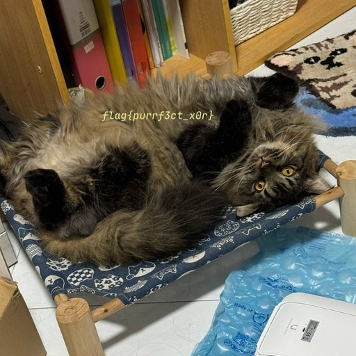

# Scrambled Pawtrait

## 题目简述

附件提供两张尺寸、模式完全相同的 512×512 RGB PNG。两张图是按像素、按通道拆分的 XOR 份额；任意单张都不能直接看到原图，但相同位置执行异或即可消去掩码并恢复藏有文字的猫咪照片。

## 解题过程

先确认两张图的尺寸和颜色模式一致，再把它们转换为无符号 8 位数组并逐元素 XOR：

```python
from PIL import Image
import numpy as np

a = np.array(Image.open("pawtrait_a.png").convert("RGB"), dtype=np.uint8)
b = np.array(Image.open("pawtrait_b.png").convert("RGB"), dtype=np.uint8)

assert a.shape == b.shape
Image.fromarray(a ^ b).save("recovered-cat.png")
```

恢复结果：



图片内实际写的是：

```text
flag{purrf3ct_x0r}
```

而仓库 `README.md` 与 `challenge.yml` 中登记的比赛提交 flag 是：

```text
grey{purrf3ct_x0r}
```

两者前缀不一致是公开材料本身的差异，不应把图片内容悄悄改写。比赛平台按元数据中的 `grey{...}` 形式验收。

## 方法总结

- 核心技巧：对同尺寸图像的每个 RGB 通道执行逐字节 XOR，重建原图。
- 识别信号：题目同时给出两张同形状图片，并提示 logical operators；单图外观像随机掩码或被打散的视觉信息。
- 复用要点：先统一尺寸、通道和 `uint8` 类型，避免数组广播或有符号运算；恢复后还要区分载体中显示的文本与平台元数据登记值。
